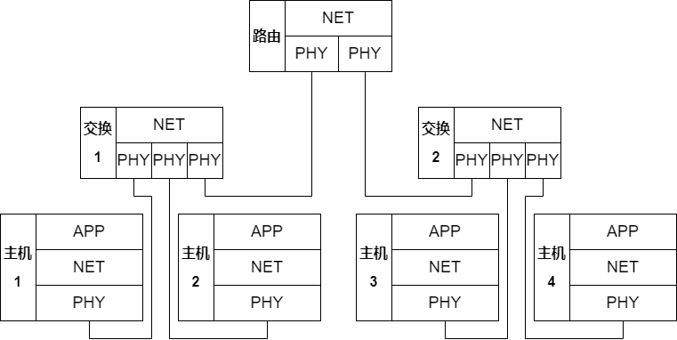
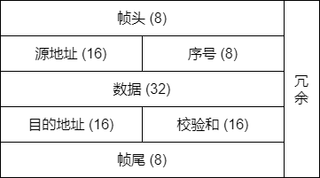
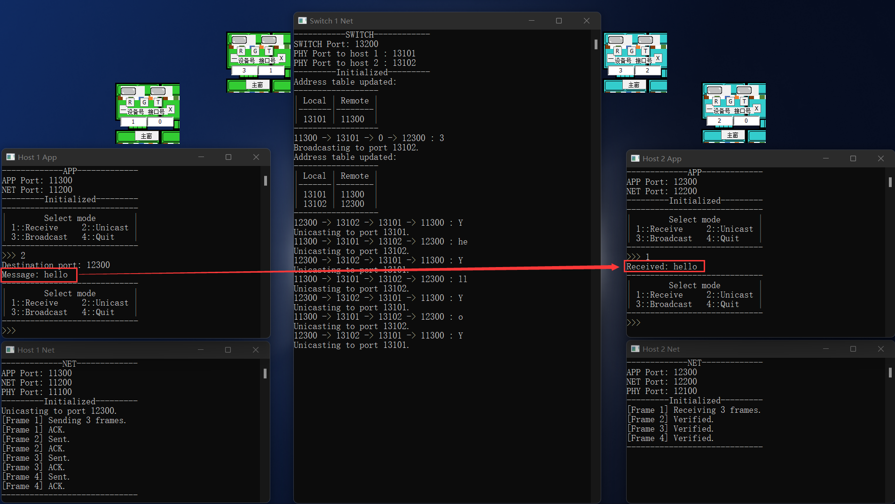

# 项目一阶段三报告

> 蔡与望 2020010801024 程序的架构、编写与调试，报告的撰写
>
> 党一琨 2020140903010 网元与帧的设计
>
> 郭培琪 2020030701003 重要函数的设计
>
> 陶砚青 2020040401013 程序的调试与debug

- [项目一阶段三报告](#项目一阶段三报告)
  - [一、整体架构](#一整体架构)
    - [1.1 网络拓扑](#11-网络拓扑)
    - [1.2 帧结构](#12-帧结构)
    - [1.3 代码目录结构](#13-代码目录结构)
  - [二、应用层](#二应用层)
    - [2.1 决定网元模式](#21-决定网元模式)
    - [2.2 信息I/O](#22-信息io)
    - [2.3 编解码](#23-编解码)
    - [2.4 代码框架](#24-代码框架)
    - [2.5 阶段一调试](#25-阶段一调试)
  - [三、网络层（主机）](#三网络层主机)
    - [3.1 帧的结构](#31-帧的结构)
    - [3.2 帧同步与定位](#32-帧同步与定位)
      - [3.2.1 基本原理](#321-基本原理)
      - [3.2.2 代码实现](#322-代码实现)
    - [3.3 地址读写](#33-地址读写)
      - [3.3.1 取16位的原因](#331-取16位的原因)
      - [3.3.2 代码实现](#332-代码实现)
    - [3.4 序号读写](#34-序号读写)
      - [3.4.1 取8位的原因](#341-取8位的原因)
      - [3.4.2 代码实现](#342-代码实现)
    - [3.5 差错检测](#35-差错检测)
      - [3.5.1 基本原理](#351-基本原理)
      - [3.5.2 视每8位为一个整数的原因](#352-视每8位为一个整数的原因)
      - [3.5.3 代码实现](#353-代码实现)
    - [3.6 差错控制](#36-差错控制)
      - [3.6.1 基本原理](#361-基本原理)
      - [3.5.2 采用停等协议的原因](#352-采用停等协议的原因)
      - [3.6.3 代码实现](#363-代码实现)
    - [3.7 流量控制](#37-流量控制)
      - [3.7.1 基本原理](#371-基本原理)
      - [3.7.2 代码实现](#372-代码实现)
    - [3.8 代码框架](#38-代码框架)
    - [3.9 阶段二调试](#39-阶段二调试)
      - [3.9.1 Unicode字符的I/O](#391-unicode字符的io)
      - [3.9.2 差错的检测与重传](#392-差错的检测与重传)
  - [四、网络层（交换机）](#四网络层交换机)
    - [4.1 监听各端口消息](#41-监听各端口消息)
    - [4.2 维护端口地址表](#42-维护端口地址表)
    - [4.3 多主机信息交换](#43-多主机信息交换)
    - [4.4 代码框架](#44-代码框架)
    - [4.5 阶段三调试](#45-阶段三调试)
      - [4.5.1 单播的支持](#451-单播的支持)
      - [4.5.2 广播的支持](#452-广播的支持)
      - [4.5.3 反向学习](#453-反向学习)
    - [4.6 反思、总结与心得](#46-反思总结与心得)
  - [五、网络层（路由器）](#五网络层路由器)

## 一、整体架构

### 1.1 网络拓扑



我们的网络拓扑模型共设有7个网元：1台路由器、2台交换机、4台主机。各网元间形成**树形拓扑**，通过课程提供的物理层模拟软件进行互联。

主机的网元分为三层，分别是**应用层、网络层与物理层**；而路由器与交换机，由于不需要与用户进行I/O操作，不设应用层。各层间通过（手动或自动）设定的端口进行通信。

网元各层的主要功能如下：

- 应用层
  - 决定网元模式
  - 信息I/O
  - 编解码
- 网络层（主机）
  - 帧同步与定位
  - 地址读写
  - 序号读写
  - 差错检测
  - 差错控制
  - 流量控制
- 网络层（交换机）
  - 监听各端口消息
  - 维护端口地址表
  - 多主机信息交换
- 物理层
  - 连接起各网元
  - 模拟误码
  - 模拟MTU
  - 添加时钟信号等冗余位

### 1.2 帧结构

在我们的设计中，网元间以帧为单位交换信息；帧内除了用户发送的数据，还有网络层添加的各种控制信息，用于实现差控、流控、判收等功能。



上图是我们组设计的帧结构。它包括以下这几部分：

- 帧头、帧尾（8位）
- 源地址、目的地址（16位）
- 帧序号（8位）
- 数据（32位，只能少不能多）
- 校验和（16位）
- 冗余（位数不等，帧同步的副产物）

具体每一部分的功能、原理与实现见[第3章](#三网络层)。

### 1.3 代码目录结构

程序使用`C++`编写，网元的每一层是一个`.cpp`文件，交换机、路由器的网络层单独编写一个`.cpp`文件；另外编写有一些封装类、函数的头文件、源文件。


## 二、应用层

在整个网元中，应用层主要承担着三部分职责：

- 决定网元模式
  - 控制整个网元处于接收还是发送模式。
- 信息I/O
  - 发送端：读取用户想传输的消息；
  - 接收端：输出用户可辨识的消息。
- 编解码
  - 发送端：Unicode字符→01字符串；
  - 接收端：01字符串→Unicode字符。

下面将分别展示这三种功能。

### 2.1 决定网元模式

由于技术限制，本项目中的网元是半双工模式，即同时只能处于收/发状态中的一种。这一选择将通过用户手动输入来激活，然后应用层负责将用户的选择通知到整个网元。整体的逻辑如下。

```C++
while (true) {
    if (mode == RECV) {
        // 网元成为接收端。
    } else if (mode == UNICAST || mode == BROADCAST) {
        // 网元成为发送端。
    } else if (mode == QUIT) {
        // 退出程序。
    } else {
        // 无效选项。
    }
}
```

### 2.2 信息I/O

为了操作的便利，本项目中将使用`string`类型，进行绝大部分字符操作。相应地，信息的I/O只需要调用`cin`和`cout`就能够实现。

### 2.3 编解码

由于项目需要提供对中文I/O的支持，所以显然ASCII码无法满足项目的需求，而是需要**针对Unicode字符设计编解码方案**。方案如下图所示：


其中，`MultiByteToWideChar()`和`WideCharToMultiByte()`来自`windows.h`头文件。在实际中，一个Unicode字符可以占到三个字节，但本项目的需求没有那么高，两个字节就能够实现需求，即**一个Unicode字符对应16位二进制数**。

具体代码可以在`include/coding.cpp`中找到，该头文件留下4个API供应用层（与其他层）调用：

- `decToBin()`：将十进制数转化为01字符串；
- `binToDec()`：将01字符串转化为十进制数；
- `encode()`：将可读字符串编码为01字符串；
- `decode()`：将01字符串解码为可读字符串。

### 2.4 代码框架

细化[2.1节](#21-决定网元模式)的逻辑后，我们很容易得出应用层的代码框架：

```C++
int main(int argc, char *argv[]) {
    // 变量、网络库与套接字的初始化。
    while (true) {
        // 选择当前模式。
        if (mode == RECV) {
            // 通知网络层正在接收。
            // 从网络层接收消息。
        } else if (mode == UNICAST || mode == BROADCAST) {
            // 通知网络层正在发送。
            if (mode == UNICAST) {
                // 如果是单播，还需要额外输入目标端口。
            }
            // 通知要发的消息。
        } else if (mode == QUIT) {
            // 通知下层退出。
            break;
        } else {
            // 无效选项，报错。
        }
    }
}
```

### 2.5 阶段一调试

为了给接下来的阶段做铺垫，我们需要先写两个简单的应用层，对网元间通信的方式、网元工作的模式有一定的理解。对于项目指导书中的需求，下面是我们测试的结果。

> 项目需求：
> 客户端定时每500ms向服务器发送一个随机整数，范围在1~500之间；
> 服务器每收到一份数据也同时产生随机整数与收到的数据相加，只有在结果大于100时才会把计算结果返回给客户端，而客户端收到超出100的结果则立即产生一个新的数据，而不是在间隔500ms后。
> 客户机需要产生20份数据，如果有超过100的结果，总运行时间应接近10-N*0.5，N为超过100的结果的数量。


可以看到，服务端与客户端之间能够进行稳定的通信，客户端通过`select()`实现了超时的判断，实际运行时间与预期时间（10-N*0.5）相符。

通过这个程序，我们了解了控制超时的两种方法：`setsockopt()`和`select()`，同时也知道如何基于不同事件做出不同的响应，对网元间通信的形式、时序等有了进一步了解。

## 三、网络层（主机）

在整个网元中，网络层（主机）的功能最多、最重要，主要分为六部分：

- 帧同步与定位
  - 发送端：让接收端在杂乱的01序列中，找到有用的信息。
- 地址读写
  - 发送端：写入源、目的地址，用于交换、路由的实现；
  - 接收端：读取源、目的地址，知道信息从哪来、是不是给自己的。
- 序号读写
  - 双端：防止传送时的帧间乱序，也用于差错控制协议的实现；
- 差错检测
  - 接收端：检查信息有没有传错，如果出错就要求重传。
- 差错控制
  - 发送端：如何实现某一帧的重传；
  - 接收端：如何让发送端知道要不要重传。
- 流量控制
  - 双端：防止自己发得太快，导致网络来不及处理、对方来不及读取……等后果。

下面我们将先展示帧的结构，然后分别展示这六种功能。

### 3.1 帧的结构

为了方便对帧的各部分操作、解析01字符串为帧、转换帧为01字符串，我们利用`C++`“面向对象”的特点，将帧作为一个类。

帧各部分的数据，作为帧的私有属性存储；对帧的操作，作为帧的公共函数绑定。下面是这个类的结构：

```C++
class Frame {
  private:
    unsigned short srcPort;
    unsigned short seq;
    string data;
    unsigned short dstPort;
    unsigned short checksum;

    bool verified;
    string checkTarget;

    string extractMessage(string raw);
    static string transform(string message);
    static unsigned short generateChecksum(string message);
    static string addLocator(string message);

  public:
    Frame();
    Frame(string raw);
    Frame(unsigned short srcPort, unsigned short seq, string data,
          unsigned short dstPort);
    ~Frame();

    unsigned short getSrcPort();
    unsigned short getSeq();
    string getData();
    unsigned short getDstPort();
    bool isVerified();

    string stringify();

    static int calcTotal(int messageLen);
};
```

我们需要额外关注这两个函数：

- `Frame(string raw)`：直接把01字符串解析为帧。
- `stringify()`：直接把帧转换成01字符串。

它们高度的封装性与实用性，使得网络层代码的描述性、可读性变得更强，逻辑也更加清晰。具体的代码可以在`include/frame.cpp`中找到。

### 3.2 帧同步与定位

采用**面向位的首尾定界法**。

#### 3.2.1 基本原理

- 发送端：变换，添加帧头帧尾。
  1. 在一帧的首尾加上`0111 1110`，以标识帧的始末位置；
  2. 帧内的信息也有可能出现`0111 1110`的序列，所以为了防止接收端把帧内信息误当作帧尾，发送端还要在帧内的每个`11111`后面插一个`0`，以免帧内出现`0111 1110`子序列。

- 接收端：找到帧头，反变换。

  1. 在物理层收到的乱码中，找到帧头`0111 1110`，然后把帧头剥落；
  2. 对于接下来出现的每个`11111`子序列：
     1. 如果接下来出现的是`0`，那这个`0`肯定是发送端插的，删掉还原。
     2. 如果接下来出现的是`1`，那这就是帧尾`0111 1110`。（因为发送方已经保证了帧内不可能出现连续6个`1`。）

#### 3.2.2 代码实现

我们主要基于`KMP`算法进行子串定位，然后封装了下面三个函数实现帧同步与定位功能：

- `addLocator()`：实现上述发送端的任务1；
- `transform()`：实现上述发送端的任务2；
- `extractMessage()`：实现上述接收端的任务1、2。

具体的代码可以在`include/frame.cpp`的`Frame`类中找到。

### 3.3 地址读写

采用**16位二进制数**标识地址。

#### 3.3.1 取16位的原因

由于本项目的网元间通信只在本机（127.0.0.1）实现，所以只需要封装源与目的地的端口即可。又因为端口范围是0~65535，所以每个端口需要用16位二进制表示。

#### 3.3.2 代码实现

发送端只需要使用简单的字符串拼接，即可把地址写入帧；接收端也只需要用`string`类的`substr()`方法，就可以提取地址信息。不再展开叙述。

### 3.4 序号读写

采用**8位二进制数**标识序号。

#### 3.4.1 取8位的原因

项目需求提出，传输数据上限约50个字符；又根据[2.3节](#23-编解码)得出的结论：一个字符为16位，所以一段消息最多有800位。

一帧最多传输32位数据，所以一段消息最多要用25帧，才能传输完毕。

又为了校验和的产生方便（见[3.5节](#35-差错检测)），序号位数需要是8的倍数——最少就是8位（范围0~255），已经有充裕的空间标识每一帧。综上，需为序号分配8位的空间。

#### 3.4.2 代码实现

序号读写与地址读写相似，只需要简单的拼接和`substr()`即可实现。不再展开叙述。

### 3.5 差错检测

采用**16位校验和**，不纠错。

#### 3.5.1 基本原理

- 发送端：产生校验和。

  1. 将前面的源地址、序号、数据、目的地址这四部分的01序列拼在一起，每8位视作一个整数；
  2. 全部加起来，得到一个整数；
  3. 再变成01序列，作为校验和。

- 接收端：检验校验和。

  1. 提取出源地址、序号、数据、目的地址这四部分信息；
  2. 使用与发送端同样的方法加和；
  3. 与校验和比较是否相同，相同即验证通过。

#### 3.5.2 视每8位为一个整数的原因

1. 前四部分最多有16+8+32+16=72位；
2. 如果使用经典的Checksum生成方法，即视16位为一个整数，首先72无法整除，带来额外麻烦；其次，得出的和有可能超过65535，校验和不止16位，占用更大空间；
3. 而如果视8位为一个整数，首先72能够整除，方便程序实现；其次，和最多只有(72÷8)×255=2295，16位能够轻松表示。

#### 3.5.3 代码实现

我们封装了函数`generateChecksum()`，实现了对任意（长度为8的倍数的）01字符串的校验码生成。

具体的代码可以在`include/frame.cpp`的`Frame`类中找到。

### 3.6 差错控制

采用**停等协议**。

#### 3.6.1 基本原理

1. 发送端：发送了一帧消息，等待接收端回复；
2. 接收端：
   1. 如果超时，则回复`NAK`。
   2. 如果收到了，但是重复了，则丢弃并回复`ACK`；
   3. 如果收到了，并且校验通过，则回复`ACK`；
   4. 如果收到了，但是校验失败，则回复`NAK`；
3. 发送端：
   1. 如果超时，则重传这一帧。
   2. 如果收到了`ACK`，则继续发下一帧；
   3. 如果收到了`NAK`，则重传这一帧；
   4. 如果收到的既不是`ACK`也不是`NAK`，则重传这一帧；
4. 回到第1步，直到传完所有帧。

#### 3.5.2 采用停等协议的原因

- 可以顺便控制流量：发送端需要等回复，所以不会发得太快；
- 编程难度大大降低：只需要实现简单时序逻辑。

#### 3.6.3 代码实现

根据[3.6.1节](#361-基本原理)所展示的时序，我们可以搭建出双端代码差错控制协议的框架：

> 注：本处代码暂不考虑广播与单播判收。

- 发送端

```C++
for (int frame = 0; frame <= sendTotal;) {
    // 发送一帧。
    // 接收对方的回复。
    if (timeout) {
        // 重传。
        continue;
    }
    if (response == ACK) {
        // 可以发送下一帧。
        ++frame;
    } else if (response == NAK) {
        // 重传。
    } else {
        // 重传。
    }
}
```

- 接收端

```C++
for (int frame = 0; frame <= recvTotal;) {
    // 接收一帧。
    if (timeout) {
        // 回复NAK。
        continue;
    }
    // 检查目标端口。
    if (notForMe) {
        // 既不回复也不接收。
        continue;
    }
    // 检查序号。
    if (isRepeat) {
        // 回复ACK但不接收。
        continue;
    }
    // 检查校验和。
    if (!isVerified) {
        // 回复NAK且不接收。
        continue;
    }
    // 接收这一帧。
    // 回复ACK。
    ++frame;
}
```

### 3.7 流量控制

采用`Sleep()`函数。

#### 3.7.1 基本原理

如果发送端发的速度过快，那么有可能导致：

- 发送端口来不及发；
- 网络来不及传；
- 接收端口来不及收；
- 接收端来不及处理。
- ……

所以，在调用`sendto()`函数前，让程序先睡眠适当的时间，就可以做到：等上一波信息完全发出去之后，再发这一波信息。

#### 3.7.2 代码实现

只需要在`sendto()`的上一行调用`Sleep()`即可。

这一操作被封装在了各层对应的`Socket`类内，具体的代码可以在`include/socket.cpp`中找到。

### 3.8 代码框架

将以上所有的功能配合起来，再对广播模式做出一些适配，我们就可以得到网络层的代码框架：

```C++
int main(int argc, char *argv[]) {
    // 变量、网络库与套接字的初始化。
    while (true) {
        // 上层通知当前模式。
        if (mode == RECV) {
            for (int frame = 0; frame <= recvTotal;) {
                // 接收一帧。
                if (timeout) {
                    // 如果超时没收到消息，回复NAK。
                    continue;
                }
                // 检查目标端口。
                if (notForMe) {
                    // 如果发来的帧不是给自己的，既不回复也不接收。
                    continue;
                }
                // 检查序号。
                if (isRepeat) {
                    // 如果重复了，回复ACK但不接收。
                    continue;
                }
                // 检查校验和。
                if (!isVerified) {
                    // 如果校验失败，回复NAK且不接收。
                    continue;
                }
                // 接收这一帧。
                // 回复ACK。
                ++frame;
            }
            // 把拼接完的消息交给应用层。
        } else if (mode == UNICAST || mode == BROADCAST) {
            // 确定目标端口。
            // 确定要发的消息。
            // 计算要分多少帧。
            // 逐帧封装。
            for (int frame = 0; frame <= sendTotal;) {
                // 发送一帧。
                // 接收对方的回复。
                // 确定要收几次回复。
                for (int i = 0; i < recvNum; i++) {
                    if (timeout) {
                     // 如果超时没收到回复，重传。
                     continue;
                 }
                 if (response == ACK) {
                     // 如果收到了ACK，可以发送下一帧。
                     ++ackTimes;
                 } else if (response == NAK) {
                     // 如果收到了NAK，重传。
                 } else {
                     // 如果收到了其它信息，重传。
                 }
                }
                // 如果每个接收端都ACK了，就可以发下一帧。
                if (ackTimes == recvNum) {
                    ++frame;
                }
            }
            // 全部发完，封装的帧可以丢弃。
        } else if (mode == QUIT) {
            break;
        }
    }
}
```

### 3.9 阶段二调试

根据上面的代码框架，我们在阶段二写出了应用层与网络层，并使用物理层模拟软件模拟了信道，在两个网元间进行了测试，结果如下。

#### 3.9.1 Unicode字符的I/O


在本测试中，用户发送的字符串“你好，test.”中同时包含了中文、英文、全半角符号。可以看到，双方可以完成正常的信息收发，应用层能够正确编解码，网络层也能够逐帧发送与确认。

#### 3.9.2 差错的检测与重传


在本测试中，我们设置物理层误码率为十万分之1000，即1%。通过网络层多次的检验、回复、重传，应用层最终能够呈现出正确、完整的字符。并且误码率还能够进一步增大。

## 四、网络层（交换机）

在网络拓扑中，交换机负责在多个主机间交换信息，从而让广播成为可能，同时也减少了P2P通路的数量。它的功能主要分为以下三部分：

- 监听各端口消息
  - 时刻注意有没有端口发来消息。
- 维护端口地址表
  - 维护本地端口-远程端口的对照表，并通过收发信息时截获端口号进行学习。
- 多主机信息交换
  - 找到到达目的地的路径，依此在不同网元间转发信息。

下面我们将分别展示这两种功能。

### 4.1 监听各端口消息

由于交换机需要同时管辖多个物理层，而且需要同时完成收发，所以不能用主机网元的半双工模式。我们考虑采用`select()`方法，轮流监听各个端口是否有消息到达。整体的逻辑如下。

```C++
for (int i = 0;; i = (i + 1) % num) {
    // 使用select()检查端口i的可读性。
    if (!readable) {
        // 如果端口i不可读，则检查下一个。
        continue;
    }
    // 如果端口i可读，就读取信息并进行转发。
}
```

### 4.2 维护端口地址表

对于主机而言，它的信息只有一条路可走——就是发到自己的物理层，然后交给交换机。但对于交换机而言，它的信息有不止一条路可走。直接广播给所有端口然后让它们自行判收，显然是浪费信道资源的一种做法，我们更希望交换机自己能够记住，发给谁的信息要走哪个端口。

这就需要它内部维护一张对照表，将本地自己的物理层端口与远程其他主机的应用层端口联系起来。我们使用`map<unsigned short, unsigned short>`类型对此进行管理。整体的逻辑如下。

```C++
// 获取截获的帧的源与目的地址。
// 查表获取这个本地端口有没有注册过源地址。
if (srcPortNotInTable) {
    // 如果表里没有这个源地址，就将这个源地址和本地端口联系起来。
}
// 查表获取目的地址对应的本地端口。
if (dstPortNotInTable) {
    // 如果表里没有这个目的地址，就向所有端口广播。下一轮回复的时候就能学习了。
}
```

### 4.3 多主机信息交换

这是交换机最基础、最本质的功能。它需要判断消息发送的形式（单播或广播），然后据此采取相应的行动。整体的逻辑如下。

```C++
if (isBroadcast || portNotFound) {
    // 如果是广播，或者没找到目的地址对应的本地端口，就给所有端口发消息。
} else {
    // 如果是单播，就直接发送。
}
```

### 4.4 代码框架

将以上的三部分结合起来，就是网络层（交换机）的代码框架。

```C++
int main(int argc, char const *argv[]) {
    // 变量、网络库与套接字的初始化。
    for (int i = 0;; i = (i + 1) % phyPortNum) {
        // 如果该端口不可读，则检查下一个。
        if (!readable) {
            continue;
        }
        // 如果可读，就读取消息。
        // 获取消息的源与目的端口。
        // 反向学习源端口。
        // 检索应该发到哪个端口。
        // 判断要单播还是广播。
        if (isBroadcast || portNotFound) {
            // 给所有端口发消息。
        } else {
            // 给对应端口发消息。
        }
    }
}
```

### 4.5 阶段三调试

#### 4.5.1 单播的支持



在测试中，我们从11300端口向12300单播“hello”。可以看到，交换机能够正确的学习并更新端口地址表，并充当两主机发送、回复、重传的桥梁，消息最终完好地传递到了12300端口。

#### 4.5.2 广播的支持


在测试中，我们从12300端口向所有端口广播“helloworld”。可以看到，在发送时，交换机能够正确识别出这是广播消息，并广播给所有剩余端口；在回复时，交换机也能够正确识别出这是单播消息，并单播给12300端口。最终，消息完好地传递到了所有端口。

#### 4.5.3 反向学习


1. 当11300端口第一次向交换机的13101端口发消息，交换机的表里还没有13101-11300的对应关系，于是它自动学习了这组关系；
2. 当交换机第一次向12300端口发消息，它的表里还没有13102-12300的对应关系，于是它向所有端口广播了这条消息；
3. 当12300端口第一次向交换机的13102端口回复消息，交换机就学习到了13102-12300这组关系；
4. 当交换机向11300端口回复消息，此时它已经学会了13101-11300的关系，所以回复以单播形式发给11300端口。
5. 此后，所有信息交互都是单播，因为交换机已经把两边与自己的对应关系都学会了。

### 4.6 反思、总结与心得

我们的程序仍然存在一些问题，主要有：

1. 端口明明检出可读，但却提取不出消息。目前暂时通过“判断接收字节数是否大于0”进行过滤，但没有根除问题。
2. 发送端向交换机发第1帧时，交换机错误识别本地接收端口号，从而导致不必要的学习。目前暂时没有找到问题的原因。

## 五、网络层（路由器）

下一步，我们将研究交换与路由技术，编写路由器，并最终完成我们的网络拓扑结构。
