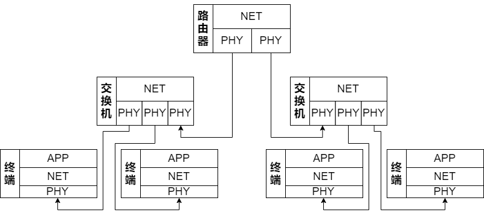
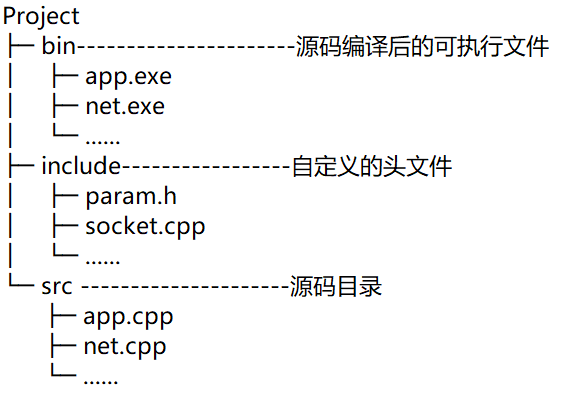
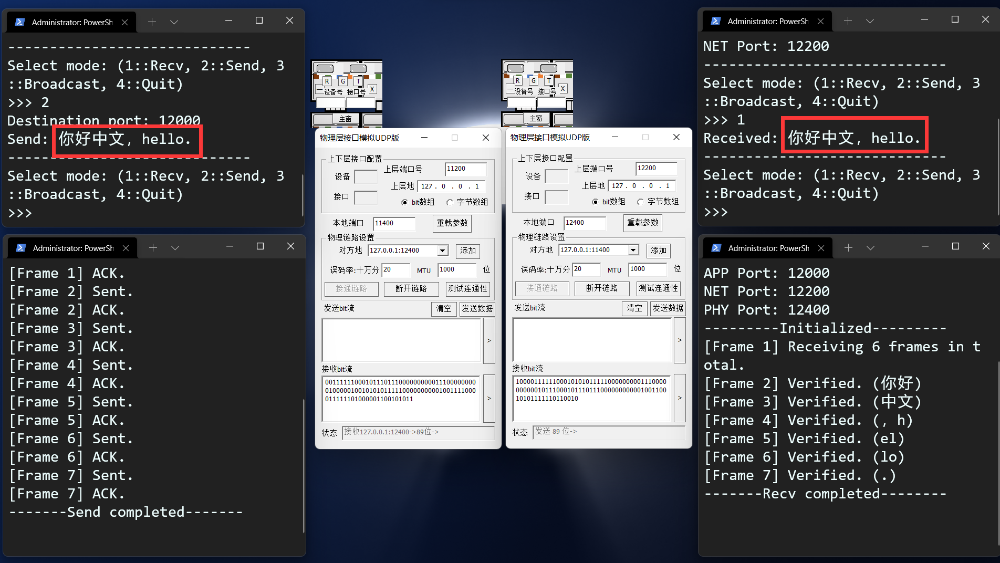

# 项目一阶段二报告

> 组员：
>
> 蔡与望 2020010801024 程序的架构、编写与调试，报告的撰写
>
> 党一琨 2020140903010 网元与帧的设计
>
> 郭培琪 2020030701003 重要函数的设计
>
> 陶砚青 2020040401013 程序的调试与debug

- [项目一阶段二报告](#项目一阶段二报告)
  - [一、整体架构](#一整体架构)
    - [1.1 网络拓扑](#11-网络拓扑)
    - [1.2 帧结构](#12-帧结构)
    - [1.3 代码目录结构](#13-代码目录结构)
  - [二、应用层](#二应用层)
    - [2.1 决定网元模式](#21-决定网元模式)
    - [2.2 信息I/O](#22-信息io)
    - [2.3 编解码](#23-编解码)
    - [2.4 代码实现](#24-代码实现)
    - [2.5 阶段一调试](#25-阶段一调试)
  - [三、网络层](#三网络层)
    - [3.1 帧同步与定位](#31-帧同步与定位)
      - [3.1.1 基本原理](#311-基本原理)
      - [3.1.2 代码实现](#312-代码实现)
    - [3.2 地址读写](#32-地址读写)
      - [3.2.1 取16位的原因](#321-取16位的原因)
      - [3.2.2 代码实现](#322-代码实现)
    - [3.3 序号读写](#33-序号读写)
      - [3.3.1 取8位的原因](#331-取8位的原因)
      - [3.3.2 代码实现](#332-代码实现)
    - [3.4 差错检测](#34-差错检测)
      - [3.4.1 基本原理](#341-基本原理)
      - [3.4.2 视每8位为一个整数的原因](#342-视每8位为一个整数的原因)
      - [3.4.3 代码实现](#343-代码实现)
    - [3.5 差错控制](#35-差错控制)
      - [3.5.1 基本原理](#351-基本原理)
      - [3.5.2 采用停等协议的原因](#352-采用停等协议的原因)
      - [3.5.3 代码实现](#353-代码实现)
    - [3.6 流量控制](#36-流量控制)
      - [3.6.1 基本原理](#361-基本原理)
      - [3.6.2 代码实现](#362-代码实现)
    - [3.7 Frame类的封装](#37-frame类的封装)
    - [3.8 代码框架](#38-代码框架)
    - [3.9 阶段二调试](#39-阶段二调试)
      - [3.9.1 Unicode字符的I/O](#391-unicode字符的io)
      - [3.9.2 差错的检测与重传](#392-差错的检测与重传)
      - [3.9.3 反思、改进与体会](#393-反思改进与体会)
  - [四、交换共享技术](#四交换共享技术)

## 一、整体架构

### 1.1 网络拓扑



在我们的网络拓扑模型设计中，共设有7个网元，分别是1台路由器、2台交换机、4台主机。各网元间通过课程提供的物理层模拟软件进行连接，网元的各层间通过`C++`程序设定的端口进行通信。

主机的网元分为三层，分别是应用层（APP）、网络层（NET）与物理层（PHY）；而路由器与交换机，由于不需要与用户进行I/O操作，不设APP层。

网元各层的主要作用如下：

- 应用层
  - 用户交互
  - 编解码
- 网络层
  - 帧同步与定位
  - 差错检测
  - 差错控制
  - 流量控制
- 物理层
  - 模拟误码
  - 模拟MTU
  - 添加时钟信号等冗余位

### 1.2 帧结构

在最小网元的设计中，网元发送信息的单位不是位，而是帧；帧内除了用户发送的数据，还有网络层添加的各种控制信息，用于实现差控、流控等功能。


上图是我们组设计的帧结构。它包括以下这几部分：

- 帧头、帧尾（8位）
- 源地址、目的地址（16位）
- 帧序号（8位）
- 数据（32位，只能少不能多）
- 校验和（16位）
- 冗余（位数不等，帧同步的副产物）

具体每一部分的功能、原理与实现，见[三、网络层](#三网络层)。

在代码中，我们还使用`Frame`类封装了帧相关的操作，这使得程序的可读性大大增强，见[3.7 Frame类的封装](#37-frame类的封装)。

### 1.3 代码目录结构

程序使用`C++`编写，网元的每一层是一个`.cpp`文件，交换机、路由器的网络层单独编写一个`.cpp`文件；另外编写有一些封装类、函数的头文件、源文件。



## 二、应用层

在整个网元中，应用层主要承担着三部分职责：

- 决定网元模式
  - 控制整个网元处于接收还是发送模式。
- 信息I/O
  - 发送端：读取用户想传输的消息；
  - 接收端：输出用户可辨识的消息。
- 编解码
  - 发送端：Unicode字符→比特序列；
  - 接收端：比特序列→Unicode字符。

下面将分别展示这三种功能。

### 2.1 决定网元模式

由于技术限制，本项目中的网元是半双工模式，即同时只能处于收/发状态中的一种。这一选择将通过用户手动输入来激活，然后应用层负责将用户的选择通知到整个网元。

```C++
int mode = 0;
while (true) {
    // 用户选择当前模式。
    cin >> mode;
    if (mode == RECV_MODE) {
        // 网元成为接收端。
    } else if (mode == SEND_MODE) {
        // 网元成为发送端。
    } else if (mode == BROADCAST_MODE) {
        // 网元成为广播的发送端。
    } else if (mode == QUIT) {
        // 退出程序。
    } else {
        // 无效选项。
    }
}
```

### 2.2 信息I/O

为了操作的便利，本项目中将使用`string`类型，进行绝大部分字符操作。相应地，信息的I/O只需要调用`cin`和`cout`就能够实现。

### 2.3 编解码

由于项目需要提供对中文I/O的支持，所以显然ASCII无法满足项目的需求，而是需要**针对Unicode字符设计编解码方案**。方案如下图所示：


其中，`MultiByteToWideChar()`和`WideCharToMultiByte()`来自`windows.h`头文件。在实际中，一个Unicode字符可以占到三个字节，但本项目的需求没有那么高，两个字节就能够实现需求，即**一个Unicode字符对应16位二进制数**。

具体代码可以在`include/coding.cpp`中找到，该头文件留下4个API供应用层（与其他层）调用：

- `decToBin()`：将十进制数转换为二进制字符串；
- `binToDec()`：将二进制字符串转换为十进制数；
- `encode()`：将一般字符串编码为二进制字符串；
- `decode()`：将二进制字符串编码为一般字符串。

### 2.4 代码实现

细化2.1节的逻辑后，我们很容易得出应用层的代码框架：

```C++
int main(int argc, char *argv[]) {
    // 变量、网络库与套接字的初始化。
    int mode = 0;
    while (true) {
        // 用户输入当前模式。
        cin >> mode;
        if (mode == RECV_MODE) {
            // 通知网络层正在接收。
            // 接收消息。
        } else if (mode == SEND_MODE) {
            // 通知网络层正在发送。
            // 告诉网络层目标端口。
            // 告诉网络层要发的消息。
        } else if (mode == BROADCAST_MODE) {
            // 通知网络层正在广播。
            // 告诉网络层目标端口。
            // 告诉网络层要发的消息。
        } else if (mode == QUIT) {
            // 通知下层退出。
            // 本层清理退出。
        } else {
            // 无效选项，报错。
        }
    }
}
```

### 2.5 阶段一调试

为了给接下来的阶段做铺垫，我们需要先写一个简单的应用层，对网元间通信的方式、网元工作的模式有一定的理解。以下是我们组测试项目指导书中阶段一需求的结果。

> 项目需求：
> 客户端定时每500ms向服务器发送一个随机整数，范围在1~500之间；
> 服务器每收到一份数据也同时产生随机整数与收到的数据相加，只有在结果大于100时才会把计算结果返回给客户端，而客户端收到超出100的结果则立即产生一个新的数据，而不是在间隔500ms后。
> 客户机需要产生20份数据，如果有超过100的结果，总运行时间应接近10-N*0.5，N为超过100的结果的数量。


可以看到，服务端与客户端之间能够进行稳定的通信，客户端通过`select`实现了超时的判断，实际运行时间与预期时间（10-0.5N）大致相符。

通过这个程序，我们了解了控制超时的两种方法：`setsockopt()`和`select`，同时也知道如何基于不同事件做出不同的响应，对网元通信时的形式、时序等有了进一步了解。

## 三、网络层

在整个网元中，网络层的功能最多、最重要，主要分为六部分：

- 帧同步与定位
  - 发送端：让接收方在杂乱的比特序列中，找到有用的信息。
- 地址读写
  - 发送端：在帧里加入源、目的地址，用于交换、路由的实现；
  - 接收端：读取源、目的地址，知道信息从哪来、是不是给自己的。
- 序号读写
  - 双端：防止传送时帧间乱序，也用于差错控制协议的实现；
- 差错检测
  - 接收端：检查信息有没有传错，如果出错就要求重传。
- 差错控制
  - 发送端：如何实现某一帧的重传；
  - 接收端：如何让发送端知道要不要重传。
- 流量控制
  - 双端：防止对方发得太快，自己来不及读取。

下面将分别展示这六种功能。

### 3.1 帧同步与定位

采用**面向位的首尾定界法**，实现双方的帧同步与定位。

#### 3.1.1 基本原理

- 发送端：变换，添加帧头帧尾。
  1. 在一帧的首尾加上`0111 1110`，以标识帧的始末位置；
  2. 帧内的信息也有可能出现`0111 1110`的序列，所以为了防止接收端把帧内信息误当作帧尾，发送端还要在帧内的每个`11111`后面插一个`0`，以免帧内出现`0111 1110`子序列。

- 接收端：找到帧头，反变换。

  1. 在物理层收到的乱码中，找到帧头`0111 1110`，然后把帧头剥落；
  2. 对于接下来出现的每个`11111`子序列：
     1. 如果接下来出现的是`0`，那这个`0`肯定是发送端插的，删掉还原。
     2. 如果接下来出现的是`1`，那这就是帧尾`0111 1110`。（因为发送方已经保证了帧内不可能出现连续6个`1`。）

#### 3.1.2 代码实现

我们主要基于`KMP`算法进行子串定位，然后封装了下面三个函数实现帧同步与定位功能：

- `addLocator()`：实现上述发送端的任务1；
- `transform()`：实现上述发送端的任务2；
- `extractMessage()`：实现上述接收端的任务1、2。

具体的代码可以在`include/frame.cpp`的`Frame`类中找到。

### 3.2 地址读写

采用**16位二进制数**标识源与目的地的地址。

#### 3.2.1 取16位的原因

由于本项目的网元间通信只在本机（127.0.0.1）实现，所以只需要封装源与目的地的端口即可。又因为端口范围是0~65535，所以每个端口需要用16位二进制表示。

#### 3.2.2 代码实现

发送端只需要使用简单的字符串拼接，即可把地址写入帧；接收端也只需要用`string`类的`substr()`方法，就可以提取地址信息。不再展开叙述。

### 3.3 序号读写

采用**8位二进制数**标识帧的序号。

#### 3.3.1 取8位的原因

项目需求提出，传输数据约50个字符；又根据[2.3 编解码](#23-编解码)，一个字符为16位，所以一段消息最多有800位。

一帧最多传输32位数据，所以一段消息最多要用25帧，才能传输完毕。

又为了校验和的产生方便（见[3.4.1 基本原理](#341-基本原理)），序号位数需要是8的倍数——最少就是8位（范围0~255），已经有充裕的空间标识每一帧。综上，需为序号分配8位的空间。

#### 3.3.2 代码实现

序号读写与地址读写相似，只需要简单的拼接和`substr()`即可实现。不再展开叙述。

### 3.4 差错检测

采用类似校验和的方法，使用**16位校验和**，实现差错检测（不纠错）。

#### 3.4.1 基本原理

- 发送端：产生校验和。

  1. 将前面的源地址、序号、数据、目的地址这四部分的比特序列拼在一起，每8位视作一个整数；
  2. 全部加起来，得到一个整数；
  3. 再变成二进制序列，作为校验和。

- 接收端：检验校验和。

  1. 提取出源地址、序号、数据、目的地址这四部分信息；
  2. 使用与发送端同样的方法加和；
  3. 与校验和比较是否相同，相同即验证通过。

#### 3.4.2 视每8位为一个整数的原因

1. 前四部分最多有16+8+32+16=72位；
2. 如果使用经典的Checksum生成方法，即视16位为一个整数，首先72无法整除，带来额外麻烦；其次，得出的和有可能超过65535，校验和不止16位，占用更大空间；
3. 而如果视8位为一个整数，首先72能够整除，方便程序实现；其次，和最多只有(72÷8)×255=2295，16位能够轻松表示。

#### 3.4.3 代码实现

我们封装了函数`generateChecksum()`，实现了对任意（长度为8的倍数的）二进制串的校验码生成。

具体的代码可以在`include/frame.cpp`的`Frame`类中找到。

### 3.5 差错控制

采用**停等协议**实现差错控制。

#### 3.5.1 基本原理

1. 发送端：发送了一帧消息，等待接收端回复；
2. 接收端：
   1. 如果超时，则回复`NAK`。
   2. 如果收到了，但是重复了，则丢弃并回复`ACK`；
   3. 如果收到了，并且校验通过，则回复`ACK`；
   4. 如果收到了，但是校验失败，则回复`NAK`；
3. 发送端：
   1. 如果超时，则重传这一帧。
   2. 如果收到了`ACK`，则继续发下一帧；
   3. 如果收到了`NAK`，则重传这一帧；
   4. 如果收到的既不是`ACK`也不是`NAK`，则重传这一帧；
4. 回到第1步，直到传完所有帧。

#### 3.5.2 采用停等协议的原因

- 可以顺便控制流量：发送端需要等回复，所以不会发得太快；
- 编程难度大大降低：只需要实现简单时序逻辑。

#### 3.5.3 代码实现

根据[3.5.1 基本原理](#351-基本原理)中的时序，我们可以搭建出双端代码的框架：

- 发送端

```C++
for (int frame = 0; frame < sendFrameNum; ++frame) {
    // 给对面发一帧。
    // 接收对方的回复。
    if (recvBytes == 0) {
        // 如果超时没收到回复，重传。
        --frame;
        continue;
    }
    if (response == ACK) {
        // 如果收到了ACK，继续发下一帧。
    } else if (response == NAK) {
        // 如果收到了NAK，重传。
        --frame;
    } else {
        // 如果收到了其它信息，重传。
        --frame;
    }
}
```

- 接收端

```C++
for (int frame = 0; frame < recvTotal; ++frame) {
    // 接收一帧。
    if (recvBytes == 0) {
        // 如果超时没收到消息，回复NAK。
        --frame;
        continue;
    }
    // 解封、验证。
    if (isRepeat) {
        // 如果重复了，丢弃并回复ACK。
        --frame;
        continue;
    }
    if (isVerified) {
        // 如果校验通过，拼接消息，回复ACK。
    } else {
        // 如果校验失败，回复NAK。
        --frame;
    }
}
```

### 3.6 流量控制

采用`Sleep()`函数，实现简单的流量控制。

#### 3.6.1 基本原理

如果发送端发的速度过快，那么有可能导致：

- 发送端口来不及发；
- 网络来不及传；
- 接收端口来不及收；
- 接收端来不及处理。
- ……

所以，在调用`sendto()`函数前，让程序先睡眠适当的时间，就可以做到：等上一波信息完全发出去之后，这一波信息再发。

#### 3.6.2 代码实现

只需要在`sendto()`的上一行调用`Sleep()`即可。

这一操作被封装在了`CNTSocket`类内，具体的代码可以在`include/socket.cpp`中找到。

### 3.7 Frame类的封装

为了方便对帧的各部分操作、解析二进制为帧、转换帧为二进制，我们利用`C++`“面向对象”的特点，将帧作为一个类。

帧各部分的数据，使用它们本来的类型，作为帧的私有属性存储；对帧的操作，作为帧的公共函数绑定。下面是这个类的结构：

```C++
class Frame {
  private:
    unsigned short srcPort;
    unsigned short seq;
    string data;
    unsigned short dstPort;
    unsigned short checksum;
    bool verified;
    string checkTarget;

    string extractMessage(string raw);
    static string transform(string message);
    static unsigned short generateChecksum(string message);
    static string addLocator(string message);

  public:
    Frame();
    Frame(string raw);
    Frame(unsigned short srcPort, unsigned short seq, string data,
          unsigned short dstPort);
    ~Frame();

    unsigned short getSrcPort();
    unsigned short getSeq();
    string getData();
    unsigned short getDstPort();
    bool isVerified();

    string stringify();
    static int calcTotal(int messageLen);
};
```

我们需要额外关注这两个函数：

- `Frame(string raw)`：直接把二进制串解析为帧。
- `stringify()`：直接把帧转换成二进制串。

它们高度的封装性与实用性，使得网络层代码的描述性、可读性变得更强，逻辑也更加清晰。具体的代码可以在`include/frame.cpp`中找到。

### 3.8 代码框架

将以上所有的功能配合起来，再结合应用层的模式选择，我们就可以得到网络层的代码框架：

```C++
int main(int argc, char *argv[]) {
    // 变量、网络库与套接字的初始化。
    while (true) {
        // 上层通知当前模式。
        if (mode == RECV_MODE) {
            for (int frame = 0; frame < recvFrameNum; ++frame) {
                // 接收一帧。
                if (recvBytes == 0) {
                    // 如果超时没收到消息，回复NAK。
                    --frame;
                    continue;
                }
                // 解封、验证。
                if (isRepeat) {
                    // 如果重复了，丢弃并回复ACK。
                    --frame;
                    continue;
                }
                if (isVerified) {
                    // 如果校验通过，拼接消息，回复ACK。
                } else {
                    // 如果校验失败，回复NAK。
                    --frame;
                }
            }
        } else if (mode == SEND_MODE) {
            // 获取目标端口。
            // 获取要发的消息。
            // 计算要发多少帧。
            // 逐帧封装。
            // 逐帧发送。
            for (int frame = 0; frame < sendFrameNum; ++frame) {
                // 给对面发一帧。
                // 接收对方的回复。
                if (recvBytes == 0) {
                    // 如果超时没收到回复，重传。
                    --frame;
                    continue;
                }
                if (response == ACK) {
                    // 如果收到了ACK，继续发下一帧。
                } else if (response == NAK) {
                    // 如果收到了NAK，重传。
                    --frame;
                } else {
                    // 如果收到了其它信息，重传。
                    --frame;
                }
            }
            // 全部发完，封装的帧可以丢弃。
        } else if (mode == BROADCAST_MODE) {
            // 广播模式。
        } else if (mode == QUIT) {
            // 本层清理退出。
        }
    }
}
```

### 3.9 阶段二调试

根据上面的代码框架，我们在阶段二写出了APP层与NET层，并使用物理层模拟软件模拟了信道，在两个网元间进行了测试，结果如下。

#### 3.9.1 Unicode字符的I/O



在本测试中，用户发送的字符串“你好中文，hello.”中同时包含了中文、英文、全半角符号。可以看到，双方可以完成正常的信息收发，应用层能够正确编解码，网络层也能够逐帧发送与确认。

#### 3.9.2 差错的检测与重传


在本测试中，我们设置物理层误码率为十万分之1000，即1%。这样的信道环境已经比较严苛，但我们的程序通过网络层多次的检验、回复、重传，应用层最终仍能够呈现出正确、完整的字符。并且误码率还能够进一步增大。

#### 3.9.3 反思、改进与体会

首先，我们的网络层程序仍然存在着不足，我们已经在代码中使用带"!"注释标记。在此简述如下：

1. `substr()`方法偶尔会抛出意外的错误，我们尚未定位到出错点。考虑将来通过断点调试进行修复；
2. 如果接收端对最后一帧的`ACK`传错了，那么接收端已经停止接收，不再做出任何回应；但发送端认为是Unknown response，仍会继续重传，这会导致发送端无法终止。考虑将来引入`keepalive`机制。

通过本程序的编写，我们小组对网络层的各项功能有了深入的了解，对帧的封装与序列化进行了实际的体验，也对”有确认无连接“的通信时序有了基本的掌握。

## 四、交换共享技术

下一步，我们会实现交换技术，即编写一个新的`.cpp`程序，作为交换机的特殊网络层（对应不止一个物理层）。
