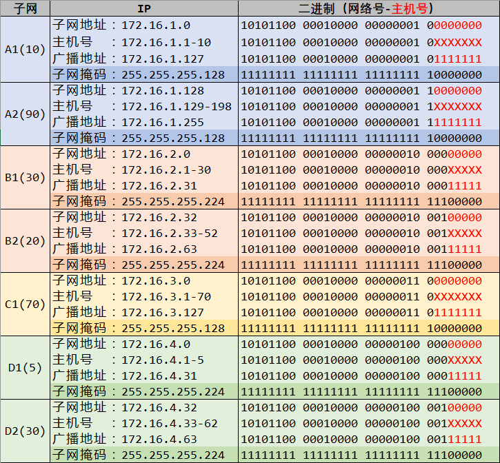

# 项目二阶段一报告

> 组号：2
> 组员：蔡与望，党一琨，郭培琪，陶砚青

---

## 一、基础知识

### 1.1 IP地址

对于互联网中的一台设备，IP地址是它独特的一个编号，以此在通信时与其他设备区分。

它是一个32位的二进制数，共有4段，每段8位；常见的IP地址使用十进制表示，如127.0.0.1。

IP地址可以分为前后两段，分别是网络号和这个网络下的主机号。

### 1.2 子网掩码

为了更充分地利用有限的地址，引入子网概念，网络层次变为网络→子网→主机。子网向主机号借用若干位，作为自己的子网号，然后剩下的主机号隶属于这个子网。

子网掩码是这样的32位二进制数：网络号与子网号的位置全为`1`，主机号的位置全为`0`。它可以用来检测两台主机是否处于同一子网下。

将子网掩码和主机IP地址作“与”运算，就能够得到这台主机所处的子网地址；就好像经过这次运算之后，主机IP掩藏在子网地址之下，故称为子网掩码。

主机地址：`11000000 10101000 00000011 10000100`（192.168.3.132）
子网掩码：`11111111 11111111 11111111 00000000`（255.255.255.0）
↓与运算↓
子网地址：`11000000 10101000 00000011 00000000`（192.168.3.0）

### 1.3 子网的划分

1. 首先确定需要$n$个子网，该子网下的主机数$s$。
2. 算上保留的子网标识地址和广播地址，共需$s+2$个地址。
3. 找到最小的$b$，使得 $2^b \ge s+2$，$b$就是主机号长度。
4. 找到最小的$a$，使得 $2^a \ge n$，$a$就是子网号最小长度。
5. 如果$a+b$没有溢出能够分配的地址长度，则该划分问题有解；向上补位子网号长度$a$。
6. 根据长度确定子网地址、主机地址、广播地址、子网掩码。

---

## 二、IP地址分配方案

题目中提供的`172.16.0.0`是一个B类地址，地址的第3、4段都可以用来分配子网号、主机号。

根据上面的知识和划分方法，同时综合考虑了IP地址利用率，我们得到了下面三套各有优劣的方案。

### 2.1 方案一

首先，我们小组想到的是把每个子网单独安排到第3段，第4段分配给子网下的主机号。

这套方案的优点在于，每一栋楼都拥有单独的网络地址，逻辑清晰；但其缺点也十分显然，即对同一个子网地址的利用率低下：如D1楼只有5台主机，却霸占了整个`172.16.6.0`分段。

因此，我们规划了第二套方案。

### 2.2 方案二

把主机数量规模相似的安排到同一子网地址下：如A2(90)和C1(70)都需要7位的主机号，就把它们放到同一子网下，享用同一子网掩码。

同一背景色代表主机号长度相同。（A1与D1的主机号长度虽然不同，但无论如何排布都得使用`172.16.3.0`分段，所以干脆选择将它们放在一组）这套方案的优点在于，充分利用了IP地址；但缺点是同一子网掩码下ABC楼混杂，调试时尚且未知是否会出现不必要的问题。

因此，我们规划了第三套方案。

### 2.3 方案三

结合了方案一和二各自的优点：ABC三楼逻辑清晰、优于方案二，IP利用率也高于方案一。

这三套方案均有各自的优劣之处，在后续的调试过程中，我们优先选择方案三；如果调不通，则继续尝试方案一；如果调通，则继续尝试方案二。
