# 项目三报告

> 姓名：蔡与望
>
> 学号：2020010801024

---

## 目录

- [项目三报告](#项目三报告)
  - [目录](#目录)
  - [一、层次化封装分析](#一层次化封装分析)
    - [1.1 TCP报文](#11-tcp报文)
      - [1.1.1 Frame](#111-frame)
      - [1.1.2 Ethernet II协议](#112-ethernet-ii协议)
      - [1.1.3 IPv4协议](#113-ipv4协议)
      - [1.1.4 TCP协议](#114-tcp协议)
      - [1.1.5 TCP报文总结](#115-tcp报文总结)
    - [1.2 DNS报文](#12-dns报文)
      - [1.2.1 UDP协议](#121-udp协议)
      - [1.2.2 DNS协议](#122-dns协议)
      - [1.2.3 DNS报文总结](#123-dns报文总结)
    - [1.3 HTTP报文](#13-http报文)
      - [1.3.1 HTTP协议](#131-http协议)
      - [1.3.2 HTTP报文总结](#132-http报文总结)
  - [二、TCP报文交互时序分析](#二tcp报文交互时序分析)
    - [2.1 建立连接-三次握手](#21-建立连接-三次握手)
    - [2.2 数据传输](#22-数据传输)
    - [2.3 断开连接-四次挥手](#23-断开连接-四次挥手)
  - [三、不同报文的协议与功能](#三不同报文的协议与功能)
    - [3.1 TCP报文](#31-tcp报文)
    - [3.2 UDP报文](#32-udp报文)
    - [3.3 DNS报文](#33-dns报文)
    - [3.4 HTTP报文](#34-http报文)
    - [3.5 ICMP报文](#35-icmp报文)
  - [四、流量成分分析](#四流量成分分析)
    - [4.1 协议分级统计](#41-协议分级统计)
      - [TCP下各部分占比和问题](#tcp下各部分占比和问题)
    - [4.2 分组长度](#42-分组长度)
    - [4.3 IO图](#43-io图)
    - [4.4 其他角度简述](#44-其他角度简述)
      - [4.4.1 流量图](#441-流量图)
      - [4.4.2 TCP流时间-序列图](#442-tcp流时间-序列图)
      - [4.4.3 TCP流吞吐量](#443-tcp流吞吐量)
  - [五、总结](#五总结)

## 一、层次化封装分析

如图为WireShark抓包时的窗口界面。在该项目中，我选择对[必应](https://cn.bing.com)发起请求，并使用WireShark截获流量与分析。可以看到，请求的源地址大多都是`192.168.31.232`，这就是本机的IPv4地址。

通过命令行执行`ping cn.bing.com`，我们可以得到该域名的IP地址：`202.89.233.101`。所以我们在过滤器中输入`ip.dst==202.89.233.101 || ip.src==202.89.233.101`，来筛选出本机与必应通信的网络报文。

为了挑选最为典型的三种报文，我们可以先进行事先的分析。
首先，目前的网络协议体系大多采用TCP/IP协议体系，所以我们与必应通信时，最常见的应该是**TCP报文**；
其次，我们在地址栏输入的是域名`cn.bing.com`而不是IP地址`202.89.233.101`，所以必然会有**DNS报文**，将域名转换为IP；
最后，无论是客户端还是服务器，请求与响应都需要用到超文本(HTTP/HTTPS)，又因为WireShark只支持单独查看**HTTP报文**，所以HTTP也是我们关注的重点。

因此，下面我们将对TCP、DNS、HTTP三种典型的报文进行细致的层次化封装分析。

### 1.1 TCP报文

上图是一个实际的TCP报文。可以看到，这个报文共分为4层：

- `Frame`：**物理层**传输的数据帧的信息。
- `Ethernet II`：**数据链路层**协议头，采用以太网协议。
- `Internet Protocol Version 4`：**网络层**协议头，采用IPv4协议。
- `Transmission Control Protocol`：**传输层**协议头，采用TCP协议。

下面依次对这4层进行分析。

#### 1.1.1 Frame

|                               信息                               |                   说明                   |
| :--------------------------------------------------------------: | :--------------------------------------: |
|                         Interface id: 0                          |                接口号为0                 |
|                 Encapsulation type: Ethernet (1)                 |            上层采用以太网协议            |
|               Arrival Time: Oct 17, 2021 10:54:08                |      捕获时间是2021.10.17的10:54:08      |
|             [Time Shift for this packet: 0 seconds]              |           这个包没有调相对时间           |
|                  Epoch Time: 1634439248 seconds                  |       自1970.1.1经过了1634439248秒       |
|  [Time delta from previous captured frame: 0.029264000 seconds]  |  该帧与上个捕获的帧相差了0.028264000秒   |
|       [Time delta from previous displayd frame: 0 seconds]       |       该帧与上个展示的帧相差了0秒        |
|     [Time since reference or first frame: 3.847185 seconds]      | 该帧与起始帧（默认第一帧）相差3.847185秒 |
|                        Frame Number: 425                         |           这是捕获到的第425帧            |
|                Frame Length: 66 bytes (528 bits)                 |          帧长度为66字节，528位           |
|               Capture Length: 66 bytes (528 bits)                |           捕获了66字节，528位            |
|                     [Frame is marked: False]                     |             该帧未被手动标记             |
|                    [Frame is ignored: False]                     |             该帧未被手动忽略             |
|            [Protocols in frame: eth:ethertype:ip:tcp]            |  帧内封装的网络协议体系：以太网+IP+TCP   |
|                [Coloring Rule Name: TCP SYN/FIN]                 |          着色方案：TCP的SYN/FIN          |
| [Coloring Rule String: tcp.flags & 0x02 \|\| tcp.flags.fin == 1] |             着色方案的字符串             |

#### 1.1.2 Ethernet II协议

|               信息               |                说明                |
| :------------------------------: | :--------------------------------: |
| Destination: `28:d1:27:0f:7a:ae` | 目的地MAC地址是`28:d1:27:0f:7a:ae` |
|   Source: `80:30:49:15:ce:c5`    |   源MAC地址是`80:30:49:15:ce:c5`   |
| LG bit: Globally unique address  |  MAC第7位，设为1可以成为特殊设备   |
|    IG bit: Individual address    |    MAC第8位，辨识是单播还是广播    |
|       Type: IPv4 (0x0800)        |          上层采用IPv4协议          |

#### 1.1.3 IPv4协议

|                   信息                    |              说明              |
| :---------------------------------------: | :----------------------------: |
|         `0100 ....` = Version: 4          |          采用IPv4协议          |
| `.... 0101` = Header Length: 20 bytes (5) |       协议头长度为20字节       |
|   Differentiated Services Field: `0x00`   | 差分服务，用来保证通信服务质量 |
|             Total Length: 52              |       目前总长度为52字节       |
|         Identification: `0x0a9e`          |         标志字段是2718         |
|             Time to live: 128             | 最多通过128个路由器，否则丢弃  |
|               Protocol: TCP               |        上层采用TCP协议         |
|         Header checksum: `0x5bd7`         |     头部数据校验和为23511      |
|   [Header checksum status: Unverified]    |      不校验头部数据校验和      |
|      Source Address: 192.168.31.232       |   源IP地址为`192.168.31.232`   |
|    Destination Address: 202.89.233.101    | 目的地IP地址为`202.89.233.101` |

#### 1.1.4 TCP协议

|               信息                |              说明              |
| :-------------------------------: | :----------------------------: |
|        Source Port: 53698         |         源端口为53698          |
|       Destination Port: 443       |         目标端口为443          |
|        [Stream index: 18]         |       地址端口的索引是18       |
|        Sequence number: 0         |        相对的序列号为0         |
| Sequence number (raw): 1788585431 |    绝对的序列号为1788585431    |
|    Acknowledge number: 0 (raw)    | 协议中的确认号为0（相对/绝对） |
|            Flags: SYN             |       这是TCP中的SYN消息       |
|           Window: 64240           |          数据窗口上限          |
|  Checksum: `0xfbdf` [unverified]  |     TCP数据包校验和为64479     |
|   [Checksum Status: Unverified]   |       不检验数据包校验和       |
|         Urgent Pointer: 0         |         未设置紧急指针         |

#### 1.1.5 TCP报文总结

TCP报文的特征在它的最后一层，这层主要分为3个大部分：

1. 端口信息，实现了双方IP端到端的通信。
2. 序号信息：支持握手与挥手，同时在传输时确保请求与响应的一一对应关系。
3. 保险信息：校验数据的准确性，支持紧急指针。

### 1.2 DNS报文

上图是一个实际的DNS报文。可以看到，这个报文共分为5层：

- `Frame`：**物理层**传输的数据帧的信息。
- `Ethernet II`：**数据链路层**协议头，采用以太网协议。
- `Internet Protocol Version 4`：**网络层**协议头，采用IPv4协议。
- `User Data Protocol`：**传输层**协议头，采用UDP协议。
- `Domain Name System`：**DNS**信息。

展开前3层的具体数据后，我们不难发现，前3层蕴含的信息类别与TCP报文完全相同，只是内容有差异。因此我们略过这3层，只对最后2层，即UDP、DNS协议头进行分析。

#### 1.2.1 UDP协议

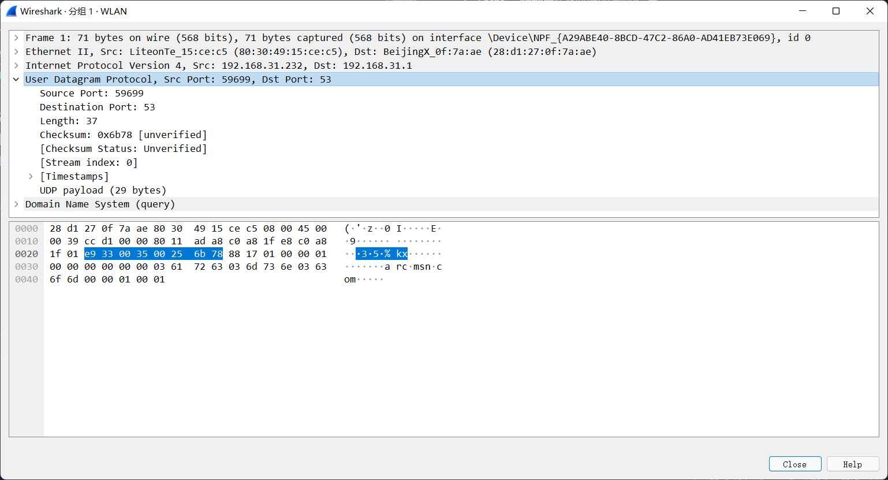

|              信息               |          说明          |
| :-----------------------------: | :--------------------: |
|       Source Port: 59699        |     源端口为59699      |
|      Destination Port: 53       |      目标端口为53      |
|           Length: 37            |      报文长度为37      |
| Checksum: `0x6b78` [unverified] | UDP数据包校验和为27512 |
|  [Checksum Status: Unverified]  |   不检验数据包校验和   |
|        [Stream Index: 0]        |   地址端口的索引是0    |
|     UDP payload (29 bytes)      | 被封装的数据包长29字节 |

#### 1.2.2 DNS协议

|            信息            |          说明          |
| :------------------------: | :--------------------: |
|  Transaction ID: `0x8817`  |  独特的信息交换标识码  |
|   `0... .... .... ....`    |     这是一个请求包     |
|   `.000 0... .... ....`    |        标准查询        |
|   `.... ..0. .... ....`    |     信息没有被截断     |
|   `.... ...1 .... ....`    |        递归请求        |
|   `.... .... .0.. ....`    |   保留字段，必须为0    |
|   `.... .... ...0 ....`    |   保留字段，必须为0    |
|        Questions: 1        |     发出了1个问题      |
|       Answer RRs: 0        |   回答资源记录数为0    |
|      Authority RRs: 0      |  权威名称服务器数为0   |
|     Additional RRs: 0      |   附加资源记录数为0    |
|     Name: arc.msn.com      |        请求域名        |
|     [Name Length: 11]      | 请求域名字符串长11字节 |
|      [Label Count: 3]      |   域名有3个组成部分    |
| Type: A (Host Address) (1) |     查询类型为A类      |
|     Class: IN (0x0001)     |     查询互联网地址     |

#### 1.2.3 DNS报文总结

DNS报文的特征在最后一层，它包含了这几部分信息：

1. 查询的方法
2. 查询的记录
3. 查询的类型

### 1.3 HTTP报文

上图是一个实际的HTTP报文。可以看到，这个报文共分为5层：

- `Frame`：**物理层**传输的数据帧的信息，`xxx`表示这是截获的第几帧。
- `Ethernet II`：**数据链路层**协议头，说明采用的是以太网协议。
- `Internet Protocol Version 4`：**网络层**协议头，注意到源和目的地都是`IPv4`地址。
- `Transmission Control Protocol`：**传输层**协议头，简要显示端口号。
- `Hypertext Transfer Protocol`：**HTTP**信息。

可以看到，前面4层与TCP报文完全一致，下面只对第5层进行分析。

#### 1.3.1 HTTP协议

由于必应只有HTTPS报文，而WireShark原生不支持抓取HTTPS报文，所以我们选择对电子科技大学的网上服务大厅发起一次请求，抓取HTTP报文。

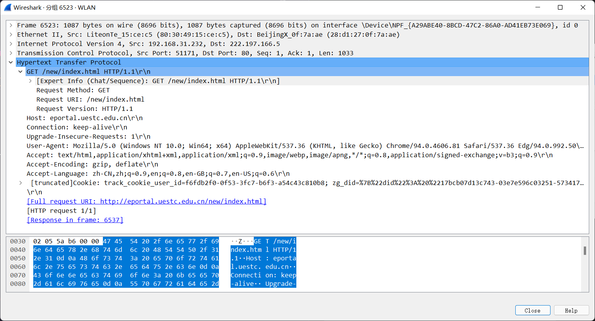

|              信息              |           说明           |
| :----------------------------: | :----------------------: |
|      Request Method: GET       |   使用GET方法发起请求    |
|  Request URL: /new/index.html  |   请求主域名下的子页面   |
|   Request Version: HTTP/1.1    |     使用HTTP/1.1协议     |
|   Host: eportal.uestc.edu.cn   |          主域名          |
|     Connection: keep-alive     |      会话使用长连接      |
|  Upgrade Insecure Requests: 1  | 把HTTP变成更安全的HTTPS  |
|     User Agent: Mozilla...     |     用户代理是浏览器     |
|     Accept: text/html, ...     | 客户能接受的返回数据类型 |
| Accept Encoding: gzip, deflate | 客户能接受的返回数据编码 |
| Accept Language: zh-CN,zh;...  | 客户能接受的返回数据语言 |
|          Cookie: ...           |       用户的Cookie       |

#### 1.3.2 HTTP报文总结

HTTP报文特征在于最后一层，大致包含这几部分信息：

1. 谁在请求
2. 请求谁
3. 怎么请求
4. 想要什么样的响应

## 二、TCP报文交互时序分析

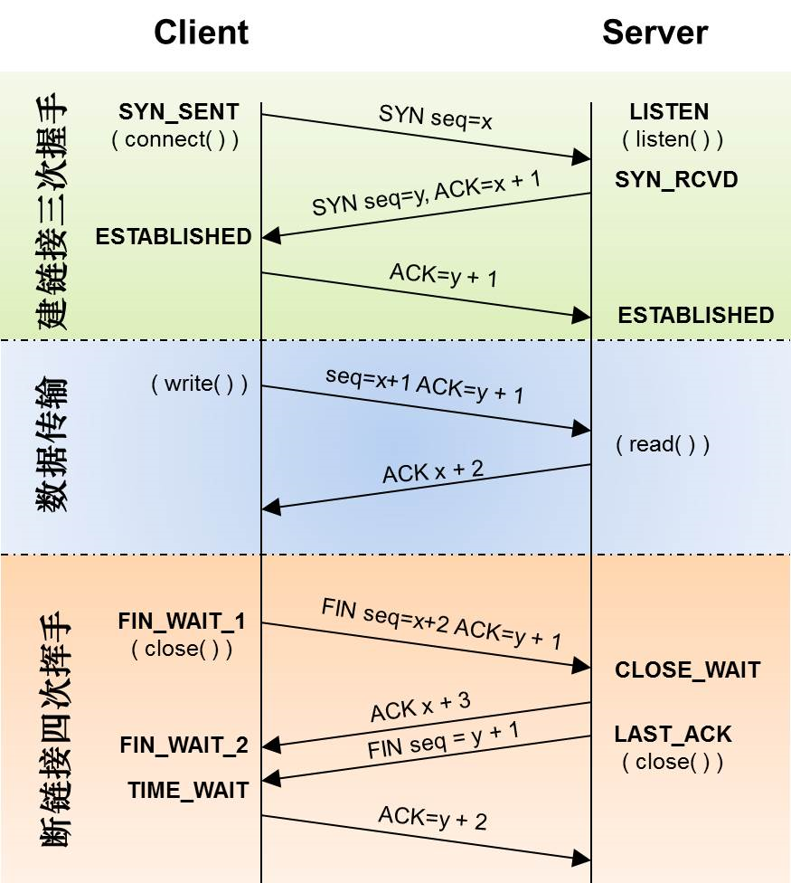

上图是TCP建立连接-数据传输-断开连接的时序示意图。根据这个流程，我们将试图在WireShark中找到对应的关键报文。

### 2.1 建立连接-三次握手

容易发现，三次握手的报文符合以下规则：

1. 第一次握手：客户端SYN(seq=x)；
2. 第二次握手：服务端ACK=x+1, SYN(seq=y)；
3. 第三次握手：客户端ACK=y+1。

并且由于之前的分析，我们知道必应的端口是443。通过这些条件的筛选，我们可以找到这三个目标报文：

下面具体分析这三个报文。

第一次握手中，客户端发送一个SYN(seq=0)包，对服务器443端口发起连接请求。

第二次握手中，服务器发送一个SYN(seq=0),ACK=1包，同意建立连接。

第三次握手中，客户端发送一个SYN(seq=1),ACK=1包，表示收到同意。

### 2.2 数据传输

由于通信保持长连接，所以在传输数据时，不会每发送一个数据包就进行握手挥手，而是不间断地进行传输，直到某一方主动断开连接。

### 2.3 断开连接-四次挥手

四次挥手符合以下规则：

1. 主动方发送FIN(seq=x), ACK=y；
2. 被动方回应ACK=x+1；
3. 被动方发送FIN(seq=y), ACK=x+1；
4. 主动方回应ACK=y+1。

据此，我们也很容易在TCP连接筛选的最后找到这四个特殊报文：

下面具体分析这四个报文。

第一次挥手中，由于用户主动关闭浏览器，所以主动关闭方是用户。用户向服务器发送FIN(seq=25738),ACK=58298包，请求关闭客户端→服务器的连接。

第二次挥手中，服务器回应ACK=25739包，同意关闭客户端→服务器的连接。
但由于两边都是全双工，此时用户仍然能收到服务器的数据；对于服务器来说，客户仍是一个占用资源的负载，所以服务器必须再主动发一遍断开连接的请求。

第三次挥手中，服务器反过来主动发送FIN(seq=58298),ACK=25739包，请求关闭服务器→客户端连接。

第四次挥手中，客户端回应ACK=58299包，同意关闭服务器→客户端的连接。

## 三、不同报文的协议与功能

### 3.1 TCP报文

TCP报文采用传输控制协议（Transmission Control Protocol），提供可靠的端到端通信，控制超时与错误的重发。

### 3.2 UDP报文

UDP报文采用用户数据报协议（User Datagram Protocol），提供面向事务的简单服务，将用户数据压缩成数据包。

### 3.3 DNS报文

DNS报文采用域名系统协议（Domain Name System），用于将用户易于记忆的域名与通信网络能识别的IP地址相互转换。

### 3.4 HTTP报文

HTTP报文采用超文本传输协议（Hypertext Transfer Protocol），用于在请求和被请求方之间发送固定格式、易于解析的请求体和响应体。

### 3.5 ICMP报文

ICMP报文采用互联网控制报文协议（Internet Control Message Protocol），用于检测网络连接状况、提供错误信息。

---

## 四、流量成分分析

在本环节中，我通过访问电子科技大学网上服务大厅，进行登录、查询等操作，抓取了4242份报文。

为了对这些流量进行分析，我们必须先知道不同报文间会在哪些方面有差异，然后在其中挑选有意义的区分点，以此对上千份报文进行分类分析。经过挑选，我找到了三个对我而言最有意义的角度：

1. 报文采用的协议体系：可以知道我们平时上网，用的最多的是什么体系结构；
2. 报文的长度：可以了解到用户与服务器交互的数据是如何分段传输的；
3. IO图：可以直观地看到当前的网络状态。

下面，我将使用Wireshark的统计工具，对这些流量进行多角度的分析。

### 4.1 协议分级统计

协议分级统计工具，可以清晰地展示已抓取报文中各种协议的占比。

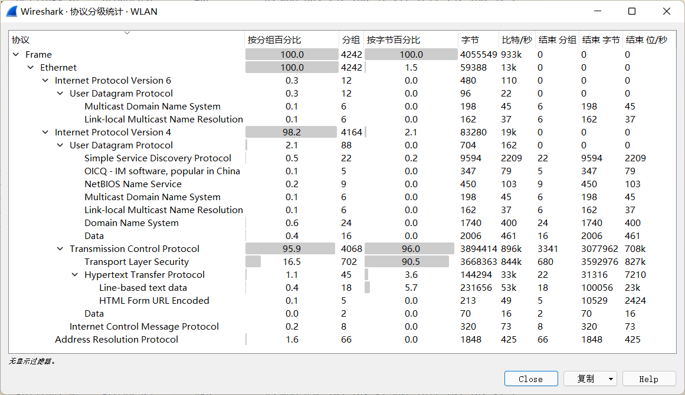

我们在最上面两行可以首先看到，Frame和Ethernet协议占据了报文的100%，说明我们所有的数据，在数据链路层都是通过Ethernet协议，按帧进行封装，然后在物理层传输。

再往下，网络层的协议开始出现区别，包括有：

- 0.3%的IPv6报文：全部是mDNS，用于在局域网内组播；
- 98.2%的IPv4报文：传输的数据主要采用IPv4协议；
- 1.6%的ARP报文：路由器用来寻址。

我们选择占比最高的IPv4下的传输层进一步分析，它的组成包括有：

- 2.1%的UDP报文：包括各域名的DNS报文，后台QQ的OICQ报文等；
- 95.9%的TCP报文：主要包括TLS、HTTP报文；
- 0.2%的ICMP报文：辅助传输控制。

#### TCP下各部分占比和问题

经过目测，我们很容易发现，TCP下各部分的占比之和远远小于TCP的总占比。这一反常的事实引起了我的注意；于是，我在过滤器中输入`tcp and !(tls) and !(_ws.malformed) and !(data) and !(http)`，试图探究剩下没显示在统计工具中的到底是什么。

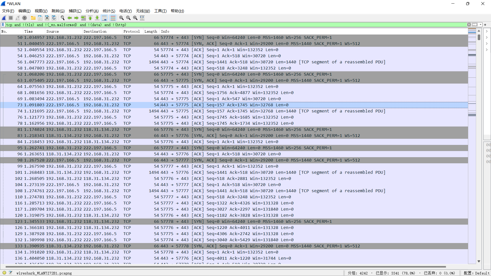

据结果显示，没有显示在统计工具中的TCP报文有SYN、ACK等确认信息，还有一些有数据负载的TCP报文，它们并不是没有数据负载，而是这些负载并不以Data的形式呈现，而是以TCP Segment Data之名呈现，所以统计工具并未将其计算在Data一项内。

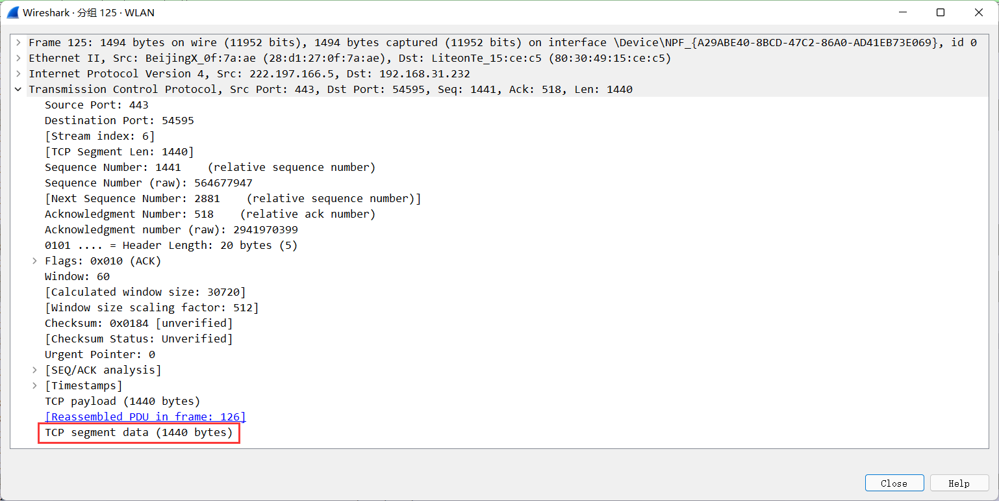

综上可得，我们平时上网与远程交互的报文，大多采用Ethernet+IP+TCP协议体系，而这些报文又以报头+负载的形式为主。

### 4.2 分组长度

分组长度工具，可以展示所有报文的长度分布。由于不同类型的报文具有不同的典型长度，这里我们只选择TCP流量进行长度的分析。

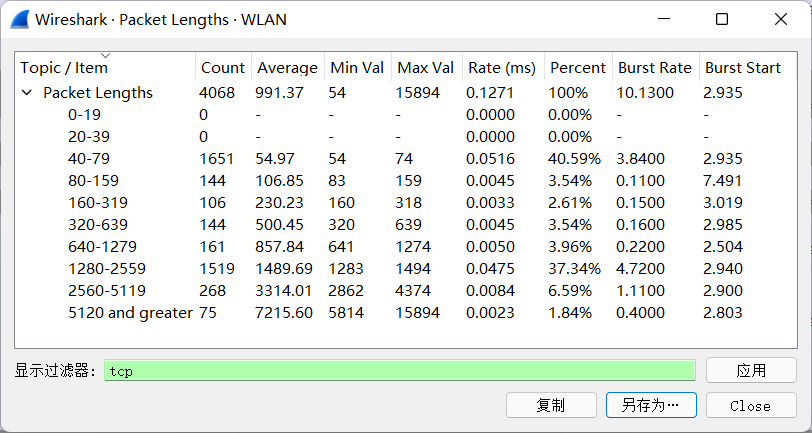

可以看到，长度大于2560的报文占了区间长度（15894）的83.9%，数量却只占了8.43%，说明报文在长度为[2560,15894]的区间上分布稀疏，不是我们研究的重点；我们只对长度在[0,2560]内的报文进一步分析。

由于Wireshark工具只能提供粗略的百分比统计，而无法统计出具体有几份几字节的报文，所以我在Wireshark抓取数据的基础上，继续使用`python`进行流量分析。将4068份TCP报文数据的长度导出为`*.txt`，然后使用`python`+`matplotlib`绘制报文长度分布图，得到下图：

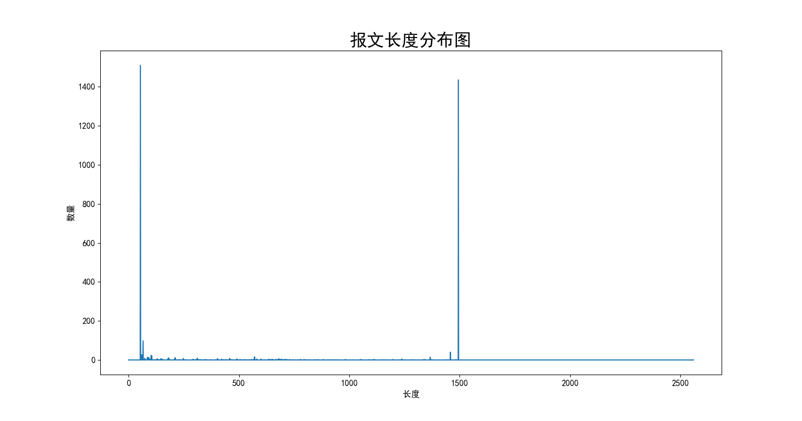

报文长度在54和1494处出现了两个高峰，其余的地方都接近于0。这显然应当引起我们的注意。通过查阅资料与小组讨论，我将这一现象的合理性解释如下：

1. TCP报头20字节，IPv4报头20字节，Ethernet报头14字节，加起来正好是54字节，所以54字节的报文代表着没有数据负载的TCP报文。
2. 以太网的最大分段大小（MSS）为1440字节，即TCP最多只能负载1440字节的数据，所以1494字节的报文代表着有数据负载的TCP报文。

除此之外，我们还找到一些长度为2934、4374、5814……的帧，这些帧并没有违反MSS，而是由服务器发来的几个包的数据拼接而成的。这可以从两个方面得到印证：

1. 首先，2934=1440×2+54，4374=1440×3+54，5814=1440×4+54，……能够解释为：服务端以同样的报头，发送了一大段数据的几个部分。
2. 其次，我们在过滤器中分别输入`tcp and frame.len>1494 and tcp.srcport==443`和`tcp and frame.len>1494 and tcp.dstport==443`，可以发现，长度大于1934的帧全部是由服务器发来本机的；而本机发往服务器的帧，长度没有一个大于1494。

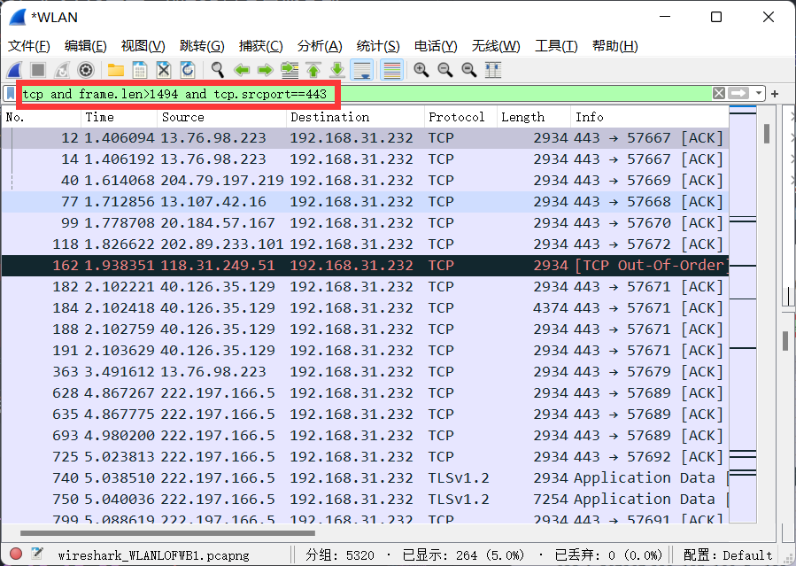

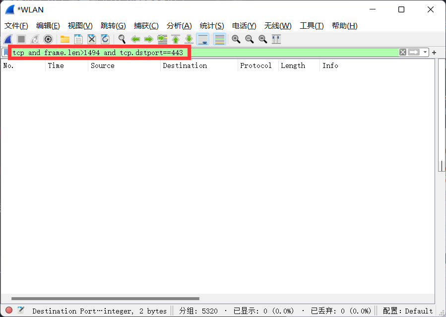

综上可得，本机与服务器交互数据时，发送的TCP报文可以分为两种，一种是带数据负载的，另一种不带；每帧带的负载长度为1440。双端发送时一帧一帧发，接收时则是将几帧拼接后一起接收。

### 4.3 IO图

IO图可以直观地检视、处理每一时刻报文的状态，包括重传、重复、丢包等。

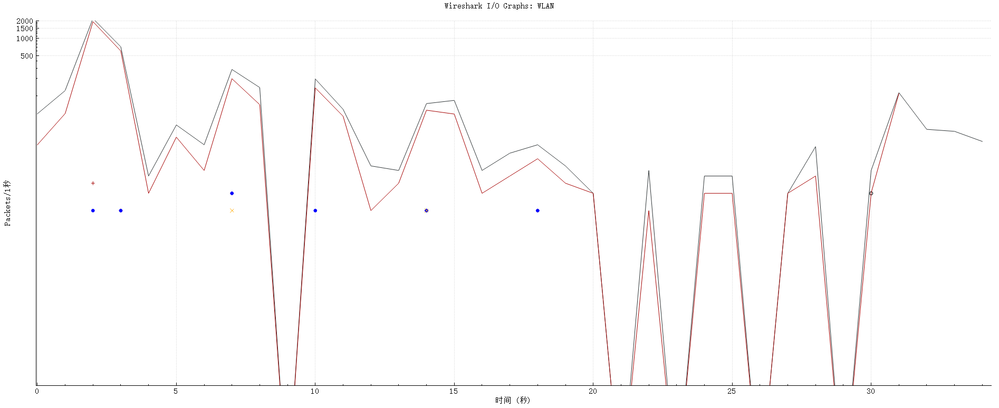

上图中，黑色曲线代表报文总数，红色曲线代表TCP报文数，红色“+”号代表丢包数，蓝色“⚪”号代表重帧数，黄色“×”号代表重传数。

在抓包的过程中，我一共进行了6步操作：访问域名→登录网站→点击“教务系统”→点击“我的课表”→退出课表→退出浏览器，每一步的时间与报文显示的6段大致相符。

在全过程的35秒内，IO图只显示了1次丢包、1次重传，说明当前的网络状态良好。

### 4.4 其他角度简述

除了协议分级统计、分组长度、IO图外，Wireshark还提供了许多工具，用于分析流量。但这些工具拥有的实际意义并不如前三种，所以这里仅做简要的叙述。

#### 4.4.1 流量图

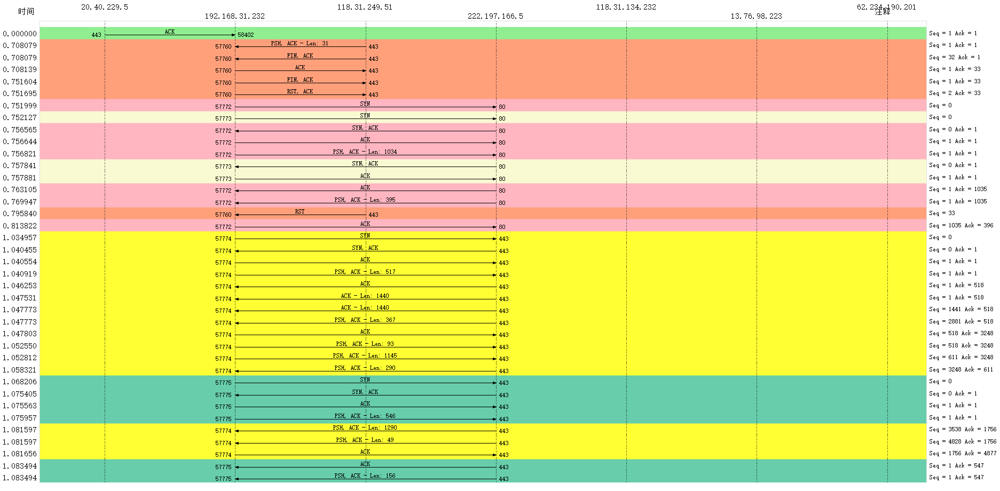

以地址为横轴，以时间为纵轴；不同颜色代表不同端口，也即不同TCP流；使用箭头标识信息在不同地址间的流向。右侧是信息概览。

流量图的好处在于，能够直观地看出信息流动的方向、哪些端口有更多的交互等。

#### 4.4.2 TCP流时间-序列图

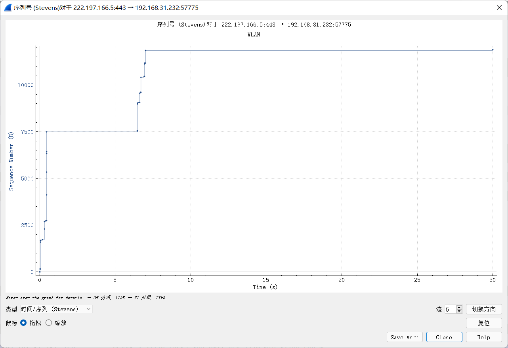

以时间为横轴，以序列号为纵轴，描绘某一TCP流中的序列号随时间的变化情况。

可以看到，0-1秒、6-8秒分别有2次陡升，说明远程443端口和本地57775端口在这两段时间内出现交互，其余时间没有信息的交流。

#### 4.4.3 TCP流吞吐量

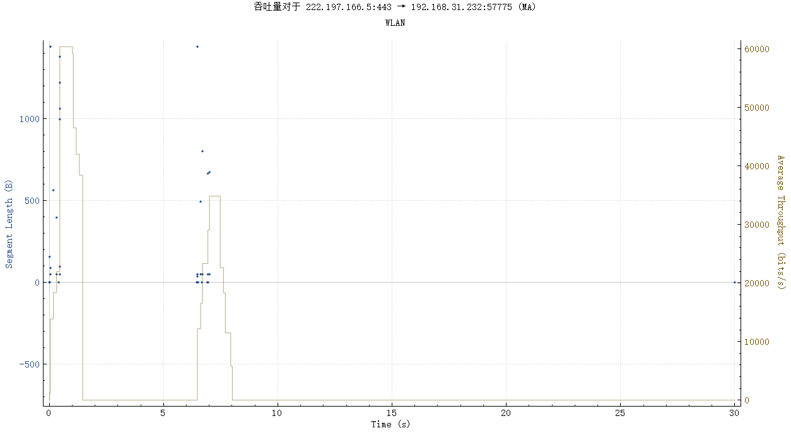

以时间为横轴，以报文长度为纵轴1，以平均吞吐量为纵轴2，描绘某一TCP流中的吞吐量情况。

可以看到，0-1秒、6-8秒两处同时出现了代表报文长度的散点和代表吞吐量的曲线峰形，说明远程443端口和本地57775端口在这两段时间内出现交互，其余时间没有信息的交流——这与[4.4.2节](#442-tcp流时间-序列图)中的分析结果一致。这两段时间对应的平均吞吐量峰值分别是60kbps和35kbps。

## 五、总结

通过对本项目的研究与学习，我受益良多。

首先，我能够熟练地使用Wireshark进行抓包，并深入了解了Ethernet、IPv4、TCP、DNS、HTTP等多种协议的封装结构，对网络通信交互中需要传什么、怎么传等实际问题有了深刻的认识；

其次，我针对TCP报文进行了更深一层的探讨，通过实操认识了TCP交互时序，包括三次握手、四次挥手，以及它们是怎么样实施的、为什么要这么做等等；

最后，我借助Wireshark、Python等工具，对我们平时上网时——在通信网络的意义上——所经历的流程，有了崭新的理解与体会，例如常用的协议体系、数据分帧传输的方式等等。

而这三点，无论是对我课程内的学习，还是其他三个项目的思路完善，或是将来会遇到的、通信网络方面的问题，都有着巨大的帮助。
