# 项目四阶段一报告

> 姓名：蔡与望
>
> 学号：2020010801024

---

## 目录

- [项目四阶段一报告](#项目四阶段一报告)
  - [目录](#目录)
  - [一、调制-解调系统的基本原理](#一调制-解调系统的基本原理)
    - [1.1 BASK](#11-bask)
      - [1.1.1 调制原理](#111-调制原理)
      - [1.1.2 解调原理](#112-解调原理)
    - [1.2 BFSK](#12-bfsk)
      - [1.2.1 调制原理](#121-调制原理)
      - [1.2.2 解调原理](#122-解调原理)
    - [1.3 BPSK](#13-bpsk)
      - [1.3.1 调制原理](#131-调制原理)
      - [1.3.2 解调原理](#132-解调原理)
    - [1.4 QPSK](#14-qpsk)
      - [1.4.1 调制原理](#141-调制原理)
      - [1.4.2 解调原理](#142-解调原理)
    - [1.5 16-QAM](#15-16-qam)
      - [1.5.1 调制原理](#151-调制原理)
      - [1.5.2 解调原理](#152-解调原理)
  - [二、基于Simulink对调制-解调系统的仿真](#二基于simulink对调制-解调系统的仿真)
    - [2.1 BASK](#21-bask)
      - [2.1.1 仿真结构](#211-仿真结构)
      - [2.1.2 仿真结果](#212-仿真结果)
    - [2.2 BFSK](#22-bfsk)
      - [2.2.1 仿真结构](#221-仿真结构)
      - [2.2.2 仿真结果](#222-仿真结果)
    - [2.3 BPSK](#23-bpsk)
      - [2.3.1 仿真结构](#231-仿真结构)
      - [2.3.2 仿真结果](#232-仿真结果)
    - [2.4 QPSK](#24-qpsk)
      - [2.4.1 仿真结构](#241-仿真结构)
      - [2.4.2 仿真结果](#242-仿真结果)
      - [2.4.3 星座图](#243-星座图)
    - [2.5 16-QAM](#25-16-qam)
      - [2.5.1 仿真结构](#251-仿真结构)
      - [2.5.2 仿真结果](#252-仿真结果)
      - [2.5.3 星座图](#253-星座图)
  - [三、信道环境对信号的影响](#三信道环境对信号的影响)
  - [四、QPSK与QAM的区别与优势](#四qpsk与qam的区别与优势)
    - [4.1 QPSK与QAM的区别](#41-qpsk与qam的区别)
    - [4.2 QPSK与QAM的优势](#42-qpsk与qam的优势)
  - [五、附录](#五附录)
    - [5.1 SNR-BER绘图源码](#51-snr-ber绘图源码)

## 一、调制-解调系统的基本原理

### 1.1 BASK

二进制幅移键控调制（Binary Amplitude-Shift Keying），通过控制载波的**幅度**来调制信号。

#### 1.1.1 调制原理

假设原始信号为$s(t)$，载波信号$f_c(t)=A\cos(\omega_c t+\theta)$，则调制后的信号为

$$f(t)=\begin{cases}
    s(t)f_c(t), s(t)=1\\\\
    0, s(t)=0
\end{cases}$$

#### 1.1.2 解调原理

先使用带通滤波器，让BASK信号完整通过，滤去其他频段的噪声。然后乘上与调制时完全相同的一列载波，信号被解调为

$$f(t)=\begin{cases}
    \frac{A^2}{2}s(t)+\frac{A^2}{2}\cos(2\omega_ct+2\theta), s(t)=1\\\\
    0, s(t)=0
\end{cases}$$

再通过低通滤波器，滤去高频成分$\frac{A^2}{2}\cos(2\omega_ct+2\theta)$。至此，代表“1”的信号段振幅应接近$\frac{A^2}{2}$，代表“0”的信号段振幅应接近0。

最后，通过参数合适的滞回比较器，就能够还原初始的电平信号。

### 1.2 BFSK

二进制频移键控调制（Binary Frequency-Shift Keying），通过控制载波的**频率**来调制信号。

#### 1.2.1 调制原理

假设原始信号为$s(t)$，载波信号$f_{c_1}(t)=A\cos(\omega_1t+\theta_1)$，$f_{c_2}(t)=A\cos(\omega_2t+\theta_2)$，则调制后的信号为

$$f(t)=\begin{cases}
    f_{c_1}(t), s(t)=1\\\\
    f_{c_2}(t), s(t)=0
\end{cases}$$

#### 1.2.2 解调原理

先仿照BASK，使用带通滤波器、相同载波、低通滤波器解调，高低频载波各得到一个解调信号。这两个解调信号，一个的“1”对应高电平，另一个的“1”对应低电平。然后通过比较器比较这两个电平，就能够判断出真实的原始电平。

### 1.3 BPSK

二进制相移键控调制（Binary Phase-Shift Keying），通过控制载波的**相位**来调制信号。

#### 1.3.1 调制原理

由于在BPSK中，两列载波的相位之差为$\pi$，即瞬时值刚好互为相反数，所以我们可以考虑预先将原始信号变为双极性信号，即将原始信号的0映射到-1；这样我们就可以只使用一列载波，为调制解调大大减少了麻烦。而这样的映射可以通过$s-\overline{s}$实现。

假设原始信号为$s(t)$，载波信号$f_c(t)=A\cos(\omega t+\theta)$，则调制后的信号为

$$f(t)=\begin{cases}
    f_c(t), s(t)=1\\\\
    -f_c(t), s(t)=0
\end{cases}$$

#### 1.3.2 解调原理

与BASK基本相同，使用带通滤波器、相同载波、低通滤波器解调，此时代表“1”的信号段振幅约为$\frac{A^2}{2}$，代表“0”的信号段振幅约为$-\frac{A^2}{2}$。

所以当信号振幅跨越0时，就代表着原始信号0和1的变化，因此使用滞回比较器就能够还原原始信号。

### 1.4 QPSK

正交相移键控调制（Quadrature Phase Shift Keying），通过**两路正交载波**调制**二比特信号**。

#### 1.4.1 调制原理

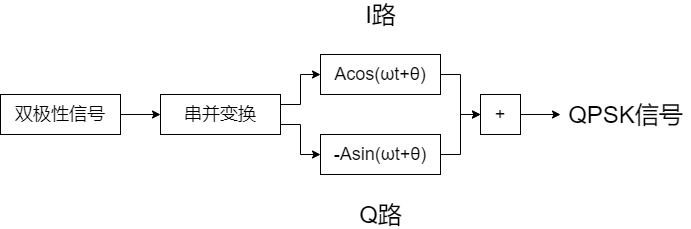

在四电平信号中，一个码元可以传输2个比特。QPSK首先通过串并变换，将第一个比特送入I路，第二个比特送入Q路；然后I路、Q路乘上正交的两列载波；最后相加，即得到QPSK信号。

假设原始信号为$s(t)$，I路载波信号$f_{c_1}(t)=A\cos(\omega t+\theta)$，Q路载波信号$f_{c_2}(t)=-A\sin(\omega t+\theta)$，则调制后的信号为

$$f(t)=\begin{cases}
    \sqrt{2}Acos(\omega t+\theta+\frac{\pi}{4}), s(t)=11\\
    \sqrt{2}Acos(\omega t+\theta+\frac{3\pi}{4}), s(t)=01\\
    \sqrt{2}Acos(\omega t+\theta+\frac{5\pi}{4}), s(t)=00\\
    \sqrt{2}Acos(\omega t+\theta+\frac{7\pi}{4}), s(t)=10\\
\end{cases}$$

#### 1.4.2 解调原理


同样经过带通滤波滤除噪声后，将信号送入I路、Q路；两路分别乘以相同载波、低通滤波后，两路高电平对应振幅为$\frac{A^2}{2}$，低电平对应振幅为$-\frac{A^2}{2}$；再通过采样判断，就能够分别在两路重现发送端的I路、Q路双极性信号；最后通过脉冲激励判断进行并串变换，合并两路得到原始双极性信号。

### 1.5 16-QAM

16-QAM（16-Quadrature Amplitude Modulation），结合QPSK和4ASK，通过**两列正交载波**调制**四比特信号**。

#### 1.5.1 调制原理

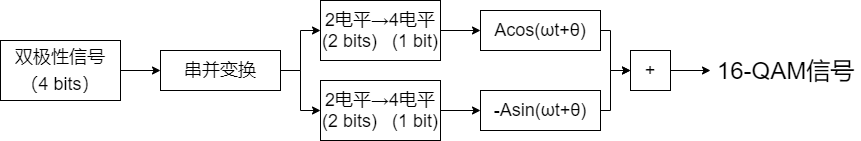

类似于QPSK，QAM先通过串并变换，将双极性四比特信号的1、3位送入I路，2、4位送入Q路；然后使用逻辑电路，将每路的2比特2电平信号映射到1比特4电平信号；乘上正交载波后相加，即得到16-QAM信号。

本组采用的2-4电平映射法则如下表所示：

| 原信号 | 双极性信号 | 4电平信号 |
| :----: | :--------: | :-------: |
| `0 0`  |  `-1 -1`   |   `-3`    |
| `0 1`  |   `-1 1`   |   `-1`    |
| `1 0`  |   `1 -1`   |    `1`    |
| `1 1`  |   `1 1`    |    `3`    |

例如，原信号某一四比特片段为`1101`，经串并变换后I路得到`10`，Q路得到`11`，映射后分别得到`1`和`3`，最后的调制信号为

$$f(t)=A\cos(\omega t+\theta)-3\sin(\omega t+\theta)$$

其他片段同理。

#### 1.5.2 解调原理

与QPSK类似，经过带通滤波滤除噪声后，将信号送入I路、Q路；两路分别乘以相同载波、低通滤波后，两路四种电平的对应振幅分别为$\frac{3A^2}{2}$、$\frac{A^2}{2}$、$-\frac{A^2}{2}$、$-\frac{3A^2}{2}$；再通过采样量化、使用反映射解码，就能够分别在两路重现发送端的I路、Q路信号（可以直接解码为单极性）；最后通过脉冲激励判断进行并串变换，合并两路得到原始信号。


例如，上一节中`1101`的调制信号$f(t)$在I路振幅约$\frac{A^2}{2}$，在Q路振幅约$\frac{3A^2}{2}$。采样量化后，将I路反映射为`10`，Q路反映射为`11`，最后并串变换得到原始信号`1101`。

## 二、基于Simulink对调制-解调系统的仿真

### 2.1 BASK

#### 2.1.1 仿真结构


上图为BASK仿真系统的结构，可分为调制、信道、解调、输出、检测五大模块。

- **调制**
  - 【伯努利二进制数生成器】1秒设10k个采样点，即基带信号频率为10kHz。
  - 【正弦波】根据采样定理，采样点不能少于20k个；由于是模拟仿真，我们直接设100k个采样点。又因载波频率应远大于基带信号频率，所以我们取正弦波频率为100kHz。

- **信道**
  - 【加性高斯白噪声】模拟真实信道的噪声，这里设SNR=2。

- **解调**
  - 【带通滤波器】下通带截止频率为90kHz（载波频率-信号频率），上通带截止频率为110kHz（载波频率+信号频率）。
  - 【正弦波】由BASK原理可知，参数与调制载波严格一致。
  - 【低通滤波器】截止频率为10kHz（信号频率），因为要把200kHz左右的成分滤掉。
  - 【滞回比较器】阈值需要根据示波器输出进行调试，最终确定在0.25。

- **输出**
  - 【示波器】各端口代表意义见实验结果分析。

- **检测**
  - 【延时模块】接收端信号相比起发送端有一定延迟，所以要将原始信号延时一定时间再进行对比。
  - 【误码率计算器&显示器】显示总传输码元数、误码码元数、误码率。

其余参数均为软件默认值。

#### 2.1.2 仿真结果


可以看到，调制后的信号、解调后的信号基本都与原理中所描述的一致。接收端最后能基本正确地还原发送端信号，误码率稳定在0.12%，延迟约2bps。


### 2.2 BFSK

#### 2.2.1 仿真结构


上图为BFSK仿真系统的结构，同样可分为调制、信道、解调、输出、检测五大模块。与BASK相同的器件参数在本处不再提及。

- **调制**
  - 【正弦波1】频率为100kHz。
  - 【正弦波2】频率为200kHz。
  - 【选择器】当输入为0时，选择200kHz载波；当输入为1时，选择100kHz载波。

- **解调**
  - 【带通滤波器1】下通带截止频率为90kHz（载波1频率-信号频率），上通带截止频率为110kHz（载波1频率+信号频率）。
  - 【带通滤波器2】下通带截止频率为190kHz（载波2频率-信号频率），上通带截止频率为210kHz（载波2频率+信号频率）。
  - 【正弦波1】由原理，与调制载波1严格一致。
  - 【正弦波2】由原理，与调制载波2严格一致。
  - 【“大于”计算器】当信号1大于信号2，输出1；反之输出2。

- **检测**
  - 【转换为double】由于“大于”计算器的结果是布尔类型，所以在输入误码率计算器前，先将其转换为浮点类型。

#### 2.2.2 仿真结果


可以看到，调制后的信号、解调后的信号基本都与原理中所描述的一致。接收端最后能基本正确地还原发送端信号，误码率接近于0，延迟约2bps。

但在每次仿真的最开始，接收端都会出现一个高电平毛刺，这一毛刺经过我多次改变元件的尝试，均无法消除。推测其出现的原因是，发送端与接收端之间有延迟，在接收端收到第一个信号前，比较器的输入处于高阻状态，所以输出有异常。但这一毛刺对实际解调的结果没有影响，所以在总的仿真过程中，选择将其忽略不计。


### 2.3 BPSK

#### 2.3.1 仿真结构

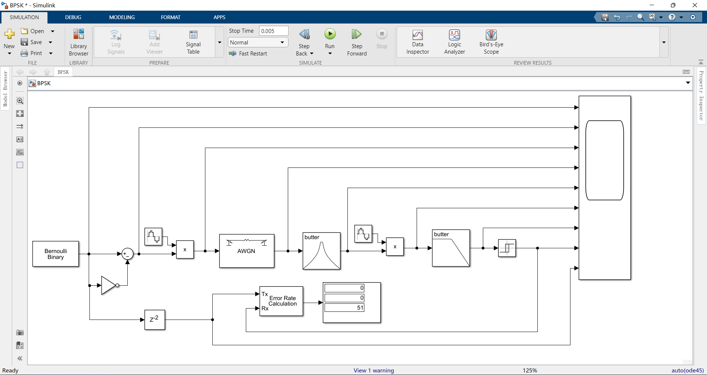

上图为BPSK仿真系统的结构，同样可分为调制、信道、解调、输出、检测五大模块。与上面相同的器件参数在本处不再提及。

- **调制**
  - 【非运算&减法器】将单极性信号转换为双极性信号。原理：$f(x)=x-\overline{x}$，$f(1)=1,f(0)=-1$。

#### 2.3.2 仿真结果


可以看到，调制后的信号、解调后的信号基本都与原理中所描述的一致。接收端最后能基本正确地还原发送端信号，误码率稳定在0.18%，延迟约2bps。


### 2.4 QPSK

#### 2.4.1 仿真结构

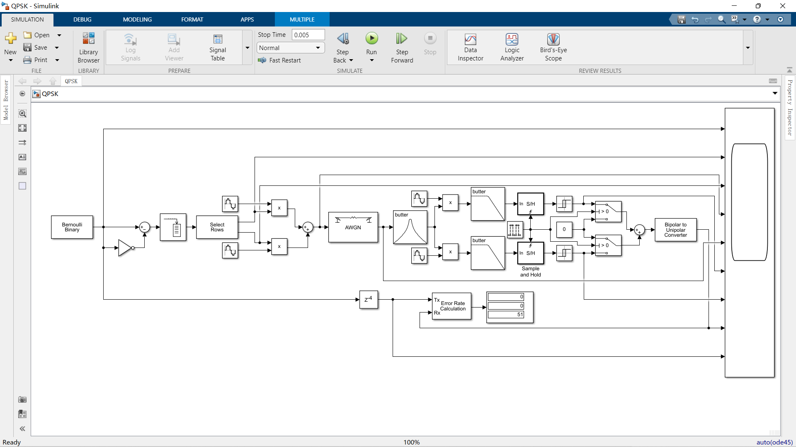

上图为QPSK仿真系统的结构，同样可分为调制、信道、解调、输出、检测五大模块。与上面相同的器件参数在本处不再提及。

- **调制**
  - 【缓冲器】缓存若干信号后，将其作为多行向量输出。容量设为2。
  - 【多端口选择器】将多行向量输出至多路。由于要分开奇偶位，所以Indice Index设为{1,2}。
  - 【正弦波1】频率为100kHz，初相$\frac{\pi}{2}$。
  - 【正弦波2】频率为100kHz，初相$\pi$。
- **解调**
  - 【脉冲生成器】以采样为参数基准，周期为2，单次脉冲宽1，初相为0，采样时间为$\frac{1}{10000}$。
  - 【采样保持器】在信号的上升沿采样并保持。
  - 【开关】使用脉冲激励，有脉冲时输出I路信号，无脉冲时输出Q路信号。
  - 【双极性到单极性转换模块】将双极性信号转换为单极性信号。

#### 2.4.2 仿真结果

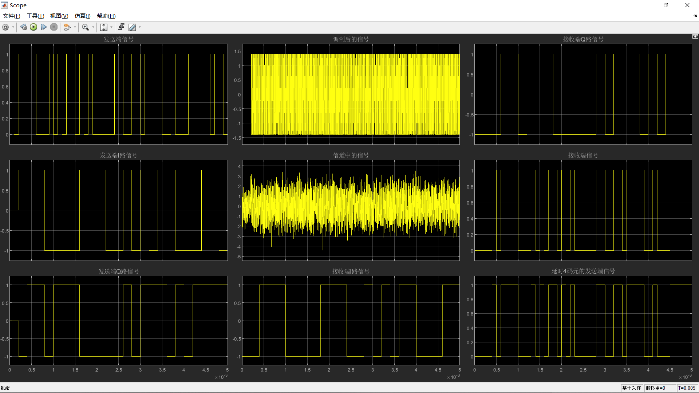

可以看到，调制后的I路、Q路信号、解调后的信号基本都与原理中所描述的一致。接收端最后能基本正确地还原发送端信号，误码率接近于0，延迟约4bps。

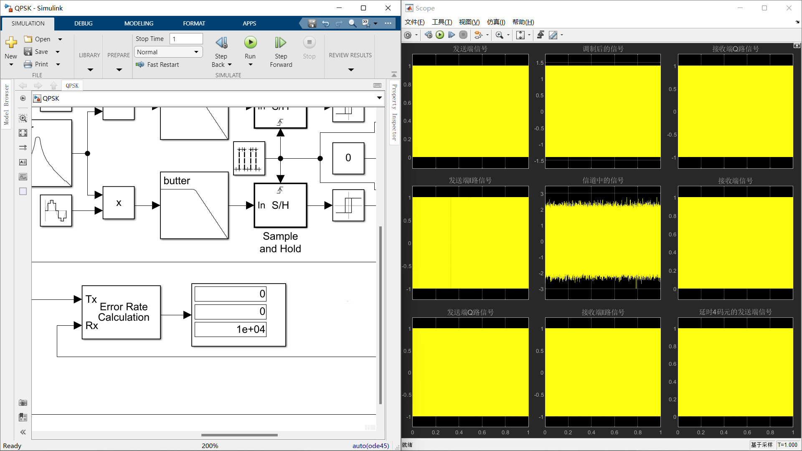

#### 2.4.3 星座图

我们使用Simulink内置的星座图模块，绘制10000个点，每个点为1次采样；分别在不同信噪比下绘制并观察。下图从左至右分别是SNR=10、20、30的情况。

<table><tr>
<td>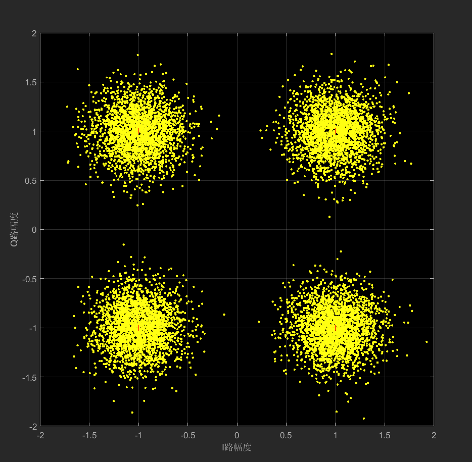</td>
<td>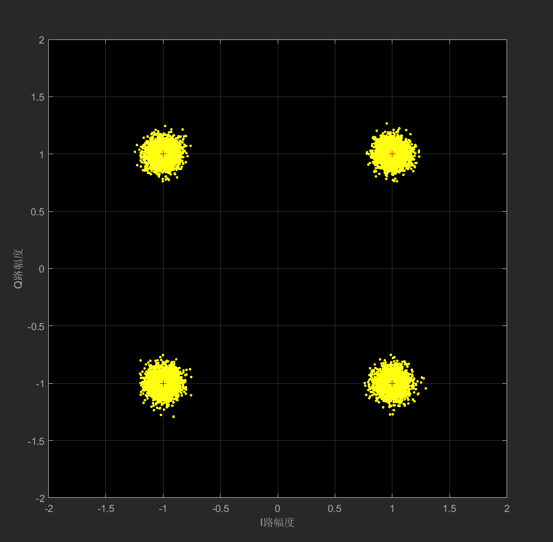</td>
<td>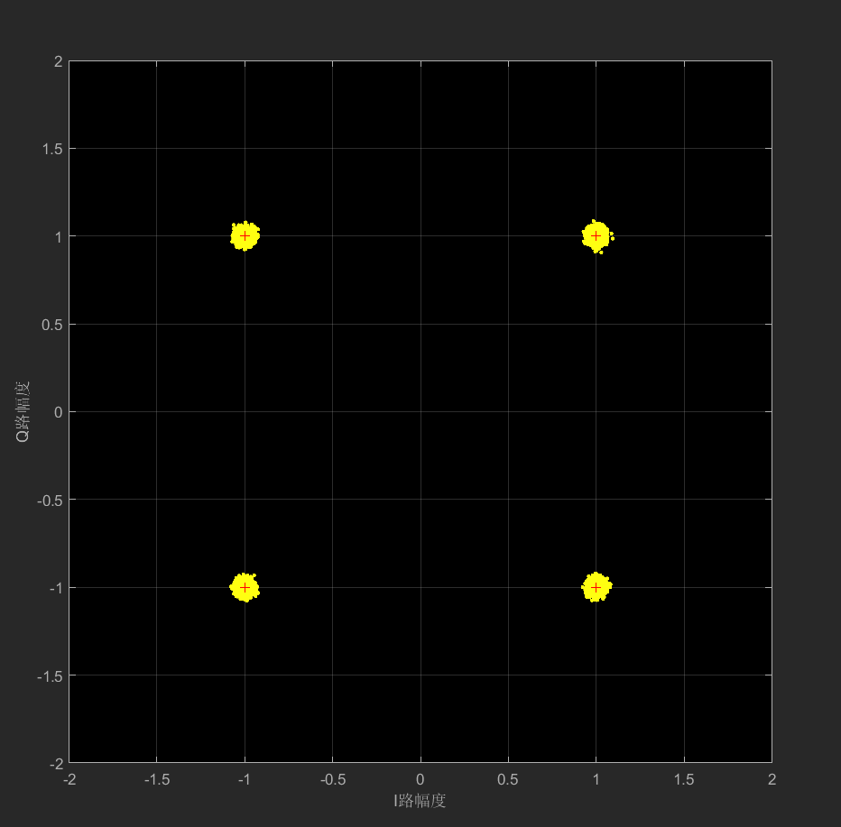</td>
</tr></table>

实际调制生成的点围绕在基准点（红色“+”号）附近；I路、Q路幅度均为1，与载波幅度相符；随着信噪比的提高，有明显的收敛至一点的趋向。这说明QPSK调制是成功的。

### 2.5 16-QAM

#### 2.5.1 仿真结构

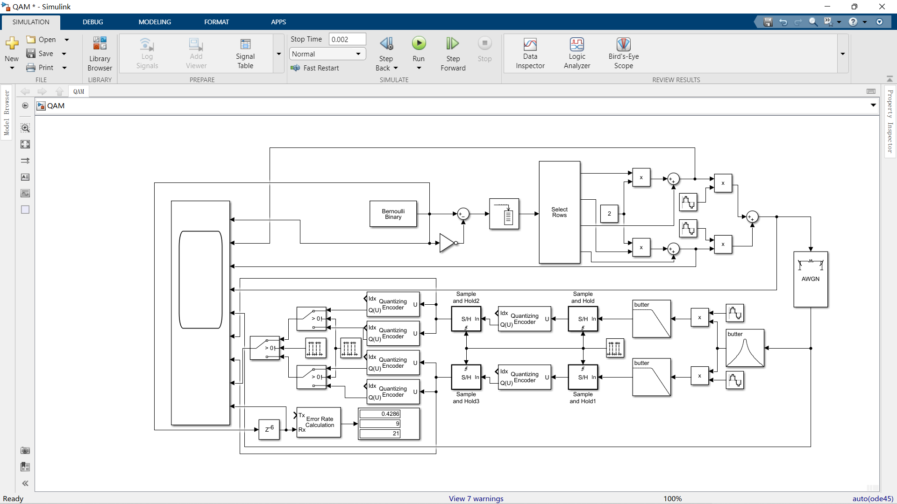

上图为QAM仿真系统的结构，同样可分为调制、信道、解调、输出、检测五大模块。与上面相同的器件参数在本处不再提及。

- **调制**
  - 【缓冲器】一次调制4比特，所以容量设为4。
  - 【多端口选择器】分离奇偶位，Indice Index设为{1,2,3,4}，然后1、3位，2、4位分别做逻辑运算。
  - 【乘法器、常数2】通过运算$2s-t$实现2-4电平的映射。
- **解调**
  - 【脉冲生成器（右）】以采样为参数基准，周期为2，单次脉冲宽1，初相为6（适配码元延迟），采样时间为$\frac{1}{10000}$。
  - 【量化模块（右，2个）】阈值设为[-1.9,0,1.9]，各段输出为[-3,-1,1,3]。
  - 【量化模块（左，第1、3个）】阈值设为[-2,0,2]，各段输出为[0,0,1,1]。
  - 【量化模块（左，第2、4个）】阈值设为[-2,0,2]，各段输出为[0,1,0,1]。
  - 【脉冲生成器（中）】用于合并每路的解码信号。以采样为参数基准，周期为4，单次脉冲宽2，初相为6（适配码元延迟），采样时间为$\frac{1}{10000}$。
  - 【脉冲生成器（左）】用于合并I路、Q路的2比特信号。以采样为参数基准，周期为2，单次脉冲宽1，初相为6（适配码元延迟），采样时间为$\frac{1}{10000}$。

#### 2.5.2 仿真结果

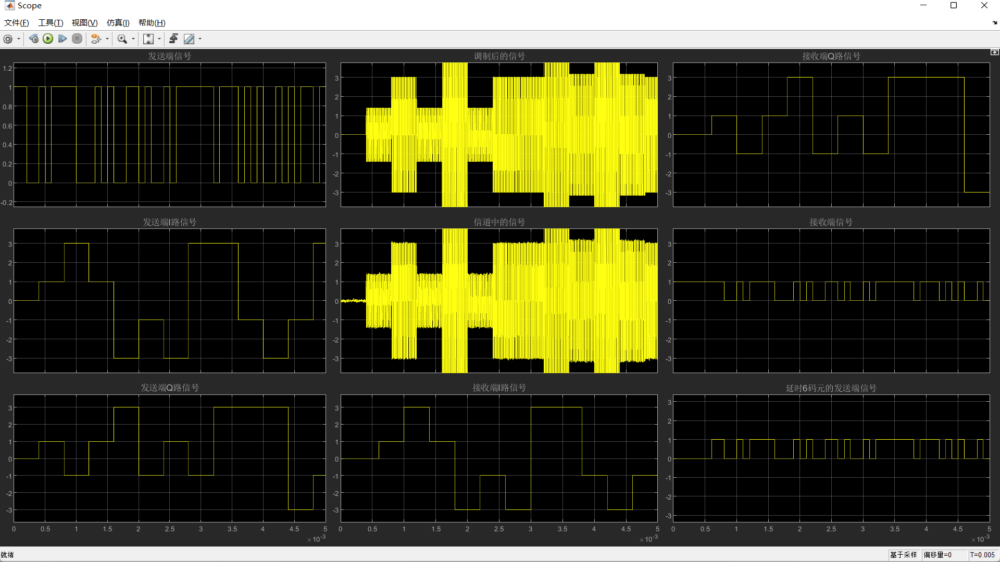

可以看到，调制后的I路、Q路信号、解调后的信号基本都与原理中所描述的一致；但接收端在未接收到任何信号前，输出恒为1，导致恒有6比特误码，但这对于实际信号没有影响，我们对此忽略不计。在仿真的过程中，我们发现这6比特误码会导致误码率计算器错误显示误码百分比，在信号完全正确的情况下，依然会有额外计算入内的误码。因此本处我们不再使用计算器来检验误码率。

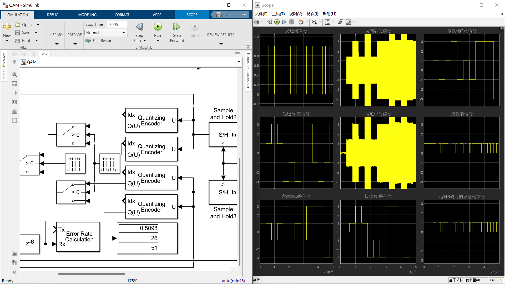

#### 2.5.3 星座图

我们使用Simulink内置的星座图模块，绘制10000个点，每个点为1次采样；分别在不同信噪比下绘制并观察。下图从左至右分别是SNR=10、20、30的情况。

<table><tr>
<td>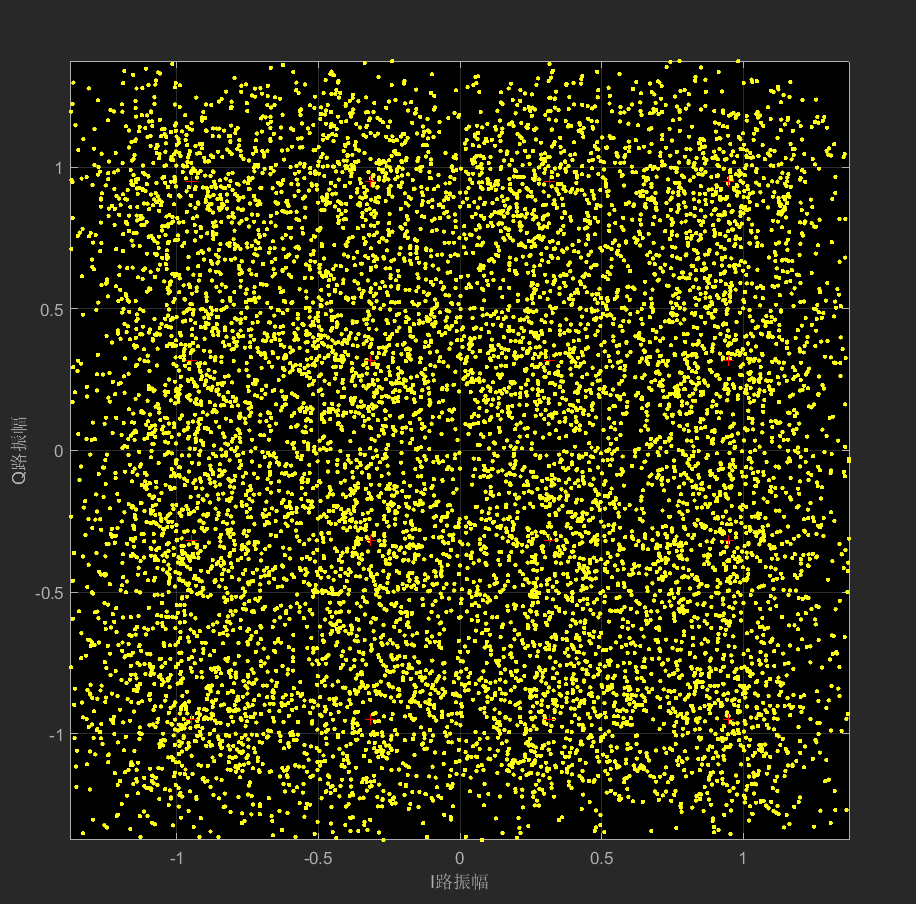</td>
<td>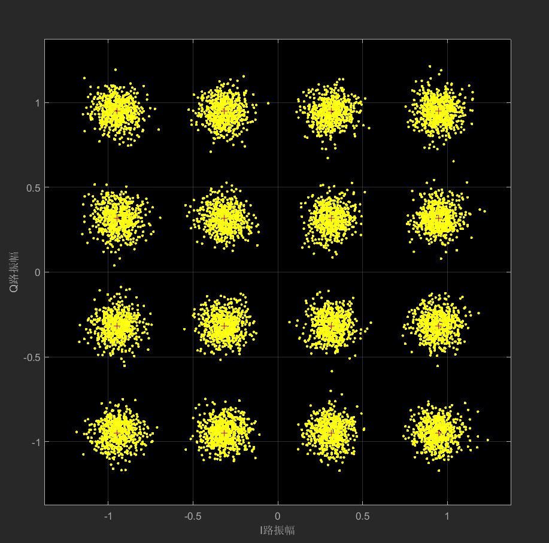</td>
<td>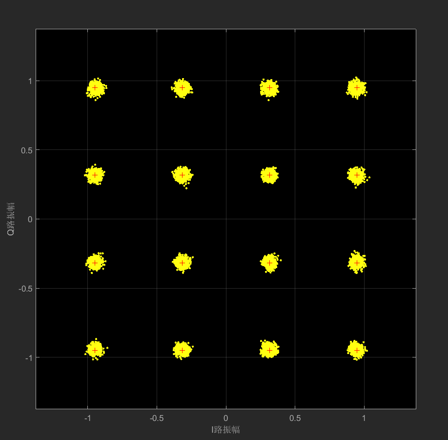</td>
</tr></table>

当SNR=10，16-QAM有极大的偏差，容易产生误码；随着SNR不断增大，实际调制生成的点逐渐围绕在基准点（红色“+”号）附近，并且有明显的收敛至一点的趋向。这说明QAM调制是成功的。

## 三、信道环境对信号的影响

我们容易知道，信噪比SNR越高，误码率BER应当越低。现以BPSK仿真为例，改变AWGN的SNR，记录每次对应的BER并绘图。（绘图源代码见附录）


可以看到，结果与预测基本一致：信噪比越高，误码率越低。当SNR=15时，误码率已经低于万分之一。

## 四、QPSK与QAM的区别与优势

### 4.1 QPSK与QAM的区别

- QPSK是4电平编码，一个码元包含2个比特；16-QAM是16电平编码，一个码元包含4个比特。
- QPSK只是用正交载波对奇偶位分别进行调制，调制仅限于相位；16-QAM在正交载波基础上还使用4ASK进一步调制，调制包括相位和幅度。
- 为了达到相同的误码率，16-QAM相比于QPSK，需要更高的信噪比——从星座图角度理解，这是因为16-QAM的基准点间的距离比QPSK更近，更容易出现误判。

### 4.2 QPSK与QAM的优势

它们都使用多电平编码，将高速的信号转换为低速信号（QPSK将速度降至$\frac{1}{2}$，16-QAM将速度降至$\frac{1}{4}$）。所以，在信道容量不变的情况下，发送端可以以更高的速率发送信号。

## 五、附录

### 5.1 SNR-BER绘图源码

```python
import matplotlib.pyplot as plt
import numpy as np

plt.style.use(['ggplot', 'fast'])

SNR = np.arange(1, 15.5, 0.5)
BER = np.array([
    1.064e-1,  # 1.0
    9.929e-2,  # 1.5
    9.329e-2,  # 2.0
    8.939e-2,  # 2.5
    8.139e-2,  # 3.0
    7.579e-2,  # 3.5
    6.279e-2,  # 4.0
    6.019e-2,  # 4.5
    5.399e-2,  # 5.0
    4.790e-2,  # 5.5
    4.210e-2,  # 6.0
    3.560e-2,  # 6.5
    3.140e-2,  # 7.0
    2.510e-2,  # 7.5
    1.970e-2,  # 8.0
    1.780e-2,  # 8.5
    1.460e-2,  # 9.0
    1.160e-2,  # 9.5
    9.099e-3,  # 10.0
    7.399e-3,  # 10.5
    5.399e-3,  # 11.0
    4.100e-3,  # 11.5
    3.300e-3,  # 12.0
    1.800e-3,  # 12.5
    9.999e-4,  # 13.0
    6.999e-4,  # 13.5
    4.000e-4,  # 14.0
    2.000e-4,  # 14.5
    1.000e-4,  # 15.0
])
BERlg = np.log10(BER)

plt.title("AWGN's impact on BER")
plt.xlabel('SNR(dB)')
plt.ylabel('$\lgBER$')
plt.yticks(np.arange(-4, 0, 0.5))

plt.plot(SNR, BERlg)
plt.show()
```
