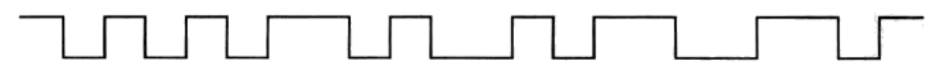

# 单元二习题

## 第 1 题

> 研究香农和奈奎斯特关于信道容量的理论，两者从不同的角度出发为信道的比特率设置了上限。它们两者之间的关系是什么？

- **相同**：都描述了信道容量和它的制约因素。
- **不同**：
  - 奈奎斯特定理只描述了理想信道中的信道容量；而香农定理在此基础上，考虑了噪声的影响；
  - 奈奎斯特定理的计算需要知道具体的调制技术（M 电平），而香农定理的计算不考虑调制技术，只需要知道信噪比。

## 第 2 题

> 假设一个信道的容量为 1MHz，SNR为 63。
>
> 1. 该信道的数据率上限是多少？
>
> 2. 上一问得到的是一个上限。但实际上，较低的数据率可以得到较好的差错表现。假设我们选择的数据率为最高理论上限，要达到这个数据率需要有几个电平的信号？

1. 数据率上限为

$$
C=B\log_{2}(1+SNR)=6Mbps
$$

2. 需要的电平数为

$$
\frac{2}{3}\times 6Mbps=2B\log_2M\Rightarrow M=4
$$

## 第 3 题

> 假设数据被存储在容量为 8.54GB 的单面双层 DVD 中，每张 DVD 的质量为 15g。假设一列从伦敦开往巴黎的欧洲之星列车上装载了 $10^4$kg 的这种 DVD。行程总长度为 640km，列车运行时间为 2 小时 15 分钟。这个系统的数据传输率是多少比特每秒？

$$
C=\frac{8.54\times \frac{10^4\times10^3}{15}\times 8}{135\times 60}=5623Gbps
$$

## 第 4 题

> 请计算当传输频率增加一倍，并且发射天线和接收天线之间的距离增加一倍时的接收功率的衰减比例。

由衰减公式

$$
L_{dB}=20\lg{f}+20\lg{d}-147.56dB
$$

显然可得衰减

$$
\Delta L_{dB}=20\lg{2}+20\lg{2}=40\lg{2}=12.04dB
$$

## 第 5 题

> 假设发送器产生的功率为 50W。
> 1. 请写出以 dBm 和 dBW 为单位的发送功率。
> 2. 如果将发送器的功率应用到单位增益天线，且载波为 900MHz，那么在自由空间距离为 100m 的地方接收到的功率为多少 dBm？
> 3. 如果其他条件不变，距离变为 10km，那么接收到的功率又是多少 dBm？
> 4. 在第 3 问基础上，现在假设接收天线的增益为 2，那么接收到的功率又是多少 dBm？

1. 以 dBm 为单位的发送功率为

$$
P_{dBm}=10\lg{\frac{50\times10^3mW}{1mW}}=47.0dBm
$$

以 dBW 为单位的发送功率为

$$
P_{dBW}=10\lg{\frac{50W}{1W}}=17.0dBW
$$

2. 衰减了

$$
L_{dB}=20\lg{f}+20\lg{d}-147.56=71.5dB
$$

所以接收功率为

$$
P=47.0dBm-71.5dB=-24.5dBm
$$

3. 距离 $d$ 变为 100 倍，则衰减增加 40dB，所以接收功率为

$$
P=-24.5dBm-40dB=-64.5dBm
$$

4. 增益为 2，则接收功率也变为 2 倍，也即增大 3 dBm。所以接收功率为

$$
P=-64.5dBm+3dBm=-61.5dBm
$$

## 第 6 题

> 图中的波形图是用曼彻斯特编码后的二进制数据流。提取时钟信息，并写出其数据序列。

从低到高跳变为 `0`，从高到低跳变为 `1`，所以数据序列为 `0001100101`。

## 第 7 题

> 为什么在把数字数据编码成为模拟信号时，PCM 要比 DM 更合适？

1. PCM 直接量化样本值，DM 则是量化差值，后者无法适应高频且变化剧烈的信号；
2. PCM 的信噪比更高，传输质量好。

## 第 8 题

> 调频广播电台的频率在 100MHz 附近、5G移动通信的频率在 3.5GHz 附近、Wi-Fi 信号的频率在 5.8GHz 附近。收音机、手机、Wi-Fi 设备的天线长度大约是多少？
>
> Wi-Fi 的 802.11n 标准，工作在 5GHz 频率，带宽达到 40MHz，数传速率如果是 150Mbps，那么要达到这么大的数传速率，信道的 SNR 不能小于多少 dB？

1. 理想天线的长度为信号的半波长，即

$$
L=\frac{c}{2f}
$$

- 收音机

$$
\frac{3\times10^8}{2\times 100\times 10^6}=1.5m
$$

- 手机

$$
\frac{3\times10^8}{2\times 3.5\times 10^9}=4.29cm
$$

- Wi-Fi 设备

$$
\frac{3\times10^8}{2\times 5.8\times 10^9}=2.59cm
$$

1. 由香农公式有

$$
150=40\lg{1+\frac{S}{N}}\Rightarrow \frac{S}{N}=2^{\frac{15}{4}}-1
$$

所以

$$
SNR=10\lg{\frac{S}{N}}=10.95dB
$$

## 第 9 题

> 将载波信号用 $x_c(t)=A\cos(\omega_ct+\phi)$ 来表达，我们分别可以在幅度、频率和相位上调制另一路低频信号 $s(t)$，请分别指出这三种调制方式作用在载波信号的什么位置？
>
> 如果 $s(t)$ 是一个数字方波信号，调制后的信号波形会有怎样的典型波形？

1. 幅度：

$$
f(t)=\begin{cases}
    A\cos(\omega_ct+\phi),s(t)=1\\
    0,s(t)=0
\end{cases}
$$

调制后会出现间隔不等的正弦波片段。

2. 频率：

$$
f(t)=\begin{cases}
    A\cos(\omega_{c_1}t+\phi),s(t)=1\\
    A\cos(\omega_{c_2}t+\phi),s(t)=0
\end{cases}
$$

调制后会出现周期不等的连续正弦波片段。

3. 相位：

$$
f(t)=\begin{cases}
    A\cos(\omega_ct+\phi_1),s(t)=1\\
    A\cos(\omega_ct+\phi_2),s(t)=0
\end{cases}
$$

调制后会出现相位突变的正弦波片段。
