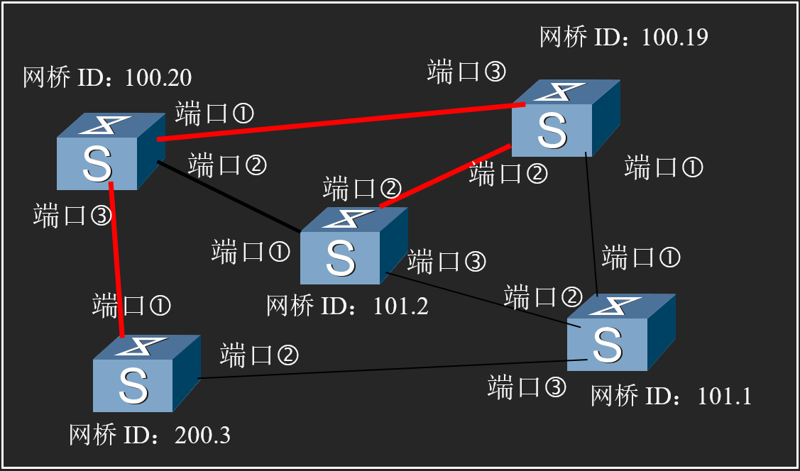

# 单元四习题

> 姓名：蔡与望
>
> 学号：2020010801024

---

## 第一题

> 一大批ALOHA用户每秒产生100次请求，包括初始请求和重传的请求。以20ms为单位进行分时隙。
>
> 1. 首次成功率为多少？
> 2. k次冲突后成功的概率是多少？
> 3. 发送尝试次数的期望值是多少？

---

## 第二题

> 假设帧长度固定为30000字节，数据传输速率为1000M bit/s；媒体最大长度为50米，请计算：
>
> 1. ALOHA协议下，冲突窗口为多长时间（即多大的时间内不能同时有两个帧）？
> 2. 采用CSMA以后，冲突窗口为多大？
> 3. 采用CSMA/CD技术以后，冲突窗口为多大？
> 4. 采用CSMA/CD技术，最大的冲突检测时间是多少？

---

## 第三题

> 请查阅网上资料自学交换机生成树算法，完成本题。以下图中都是二层交换机，红色标识的线路为1000Mbps，黑色为100Mbps，开销分别为4和19，各交换机的标识号见图，请查阅交换机生成树协议及算法的相关资料，完成各端口的设置，即得到生成树结果：即根网桥，根端口，指定端口，阻塞端口。
> 图中网桥ID：xx.yy  xx表示优先级（管理员可以配置），yy是桥的MAC地址，图中没有用标准的6字节格式，使用了以简化的数值来表示。
> 各端口的优先级都相同使用默认值。

---

## 第四题

> 以太网标准中，典型数传速率为1000Mbps，使用块传输：即一次连续传输一块数据，块之间有时间间隔。以太网标准规定：一块数据（帧）最长为1518字节（含帧头和帧尾），最小为64字节，帧前有8字节物理层前导码，块与块之间的间隔最小为传输96bit的时间，那么这个信道上的最大有效数据传输速率是多少bps，最大帧速率是多少fps？（每秒钟最多的块数）
