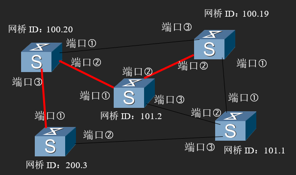
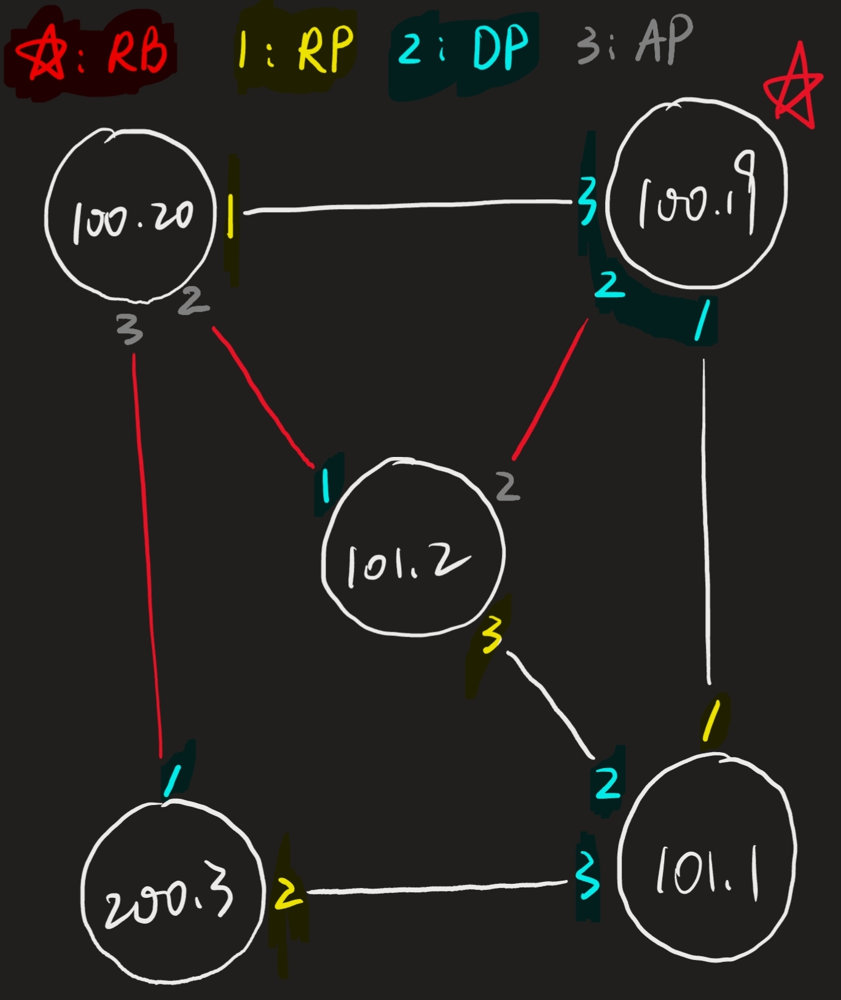

# 单元四习题

## 第 1 题

> 假设帧长度固定为 30000 字节，数据传输速率为 1000Mbps；媒体最大长度为 50米，请计算：
>
> 1. ALOHA 协议下，冲突窗口为多长时间（即多大的时间内不能同时有两个帧）？
>
> 2. 采用 CSMA 以后，冲突窗口为多大？
>
> 3. 采用 CSMA/CD 技术以后，冲突窗口为多大？
>
> 4. 采用 CSMA/CD 技术，最大的冲突检测时间是多少？

1. ALOHA 协议出现冲突的情况是，该帧传输结束前，信道中出现了其它帧。

$$
t=\frac{30000\times 8}{1000\times 1024^2}=2.29\times 10^{-4}s
$$

2. CSMA 协议出现冲突的情况是，该帧在介质中发送到另一端前，信道中出现了其它帧。

$$
t=\frac{50}{\frac{2}{3}\times 3\times 10^8}=2.5\times 10^{-7}s
$$

3. CSMA/CD 协议的冲突窗口与 CSMA 相同。

$$
t=2.5\times 10^{-7}s
$$

4. 发生冲突需要一段时间，源要知晓发生冲突还要等待相同的一段时间。

$$
t=5\times 10^{-7}s
$$

## 第 2 题

> 以太网标准中，典型数传速率为1000Mbps，使用块传输：即一次连续传输一块数据，块之间有时间间隔。以太网标准规定：一块数据（帧）最长为1518字节（含帧头和帧尾），最小为64字节，帧前有8字节物理层前导码，块与块之间的间隔最小为传输96bit的时间，那么这个信道上的最大有效数据传输速率是多少bps，最大帧速率是多少fps？（每秒钟最多的块数）

因为数据之外部分的字节数固定，所以要让有效数据传输速率尽量大，则需要数据部分尽量长，即取 1518 字节。

$$
v=\frac{1518-18}{1518+8+12}\times1000=975.3Mbps
$$

因为数传速率固定，所以要传尽量多的帧，就要让单个帧尽量小，即取 64 字节。

$$
v=\frac{1000}{(64+8+12)\times 8}Mfps=1.5Mfps
$$

## 第 3 题

> 一大批ALOHA用户每秒产生100次请求，包括初始请求和重传的请求。以20ms为单位进行分时隙。
>
> 1. 首次成功率为多少？
>
> 2. k次冲突后成功的概率是多少？
>
> 3. 发送尝试次数的期望值是多少？

1. ALOHA 协议传输 k 次的成功次数服从泊松分布 $P(k)=\frac{2^k}{k!}e^{-2}$，所以首次成功率

$$
P(0)=e^{-2}
$$

2. 由分布函数，概率为

$$
p=(1-e^{-2})^k e^{-2}
$$

3. 使用泊松分布的期望值公式，可得

$$
E(X)=e^2
$$

## 第 4 题

> 请查阅网上资料，自学交换机生成树算法，完成本题。以下图中都是二层交换机，红色标识的线路为 100Mbps，黑色为 1000Mbps，开销分别为 19 和 4，各交换机的标识号见图。请查阅交换机生成树协议及算法的相关资料，完成各端口的设置，即得到生成树结果：根网桥，根端口，指定端口，阻塞端口。
>
> 图中网桥ID：xx.yy。xx表示优先级，管理员可以配置；yy是桥的MAC地址，图中没有用标准的6字节格式，使用了以简化的数值来表示。各端口的优先级都相同，则使用默认值。

生成树的生成遵循以下原则：

1. 根网桥：
   - 网桥 ID 最小；
   - 若网桥 ID 相同，则 MAC 最小。
2. 根端口：
   - 根网桥有 0 个，非根网桥各有 1 个；
   - 到达根网桥的代价最小。
3. 指定端口：
   - 根网桥所有端口均为指定端口；
   - 每条线路均有且仅有 1 个指定端口；
   - 指定端口是非根端口；
   - 到达根网桥的代价最小。
4. 阻塞（备用）端口：
   - 非根且非指定的端口都是阻塞端口。

| 网桥 ID  | 根端口 | 指定端口 | 阻塞（备用）端口 |
| :------: | :----: | :------: | :--------------: |
| `100.19` |   /    |  1 2 3   |        /         |
| `100.20` |   1    |    /     |       2 3        |
| `101.1`  |   1    |   2 3    |        /         |
| `101.2`  |   3    |    1     |        2         |
| `200.3`  |   2    |    1     |        /         |

