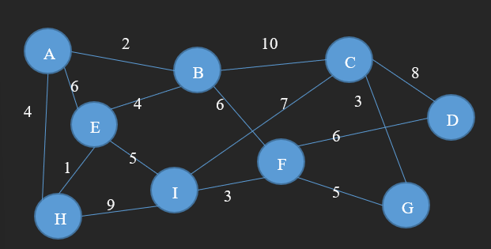

# 单元五习题

## 第 1 题

> A、B 两个节点相距 10 公里，平均数据传输速率为 5Mbps，中间经过 3 个路由器。如果网络规模为 10 万个节点，路由表按顺序检索方式，执行一条命令耗时 10ms，平均分组长度为 750 字节，经统计，平均正在通信的用户数量为 100 个左右。请分别计算当这些路由器采用虚电路交换技术和数据报交换技术下，从 A 到 B 的端到端延时（A 开始发送到 B 接收完第一个分组）。

传播延时：

$$
t_1=\frac{10\times 10^3}{\frac{2}{3}\times 3\times 10^8}=5\times 10^{-5}s
$$

传输延时：

$$
t_2=\frac{750\times 8}{5\times 1024^2}=1.2\times 10^{-3}s
$$

虚电路查表延时：

$$
t_3=\frac{1}{2}\times 100\times 10\times 10^{-3}=0.5s
$$

数据报查表延时：

$$
t_4=\frac{1}{2}\times 10^5\times 10\times 10^{-3}=500s
$$

不管对于虚电路还是数据报，延时都由以下部分组成：

- 一次传播延时
- 四次传输延时
- 三次查表延时

虚电路延时为：

$$
t=t_1+4t_2+3t_3=1.50485s
$$

数据报延时为：

$$
t=t_1+4t_2+3t_4=1500.00485s
$$

## 第 2 题

> 一个采用距离矢量路由选择算法的子网共有 6 个路由器（分别标记为 A、B、C、D、E 和 F），其中 C 与 B、D 和 E 直接相连。现在 C 路由器收到了来自以下相邻节点的路由信息：
>
> B: { A:5, C:8, D:12, E:6, F:2 }
>
> D: { A:16, B:12, C:6, E:9, F:10}
>
> E: {A:7, B:6, C:3, D:9, F:4}
>
> 已知 C 到 B、D和E 的距离分别为 6，3 和 5。请给出 C 的新路由表。

使用来自 B、D、E 的路由表，逐个与本地路由表对照，选择费用较小的那一条，最后可得：

| 目的地 | 下一跳 | 度量  |
| :----: | :----: | :---: |
|   A    |   B    |  11   |
|   B    |   B    |   6   |
|   D    |   D    |   3   |
|   E    |   E    |   5   |
|   F    |   B    |   8   |

## 第 3 题

> 一个如图的网络准备采用链路状态算法，请完成以下问题：
>
> 1. 各节点交互的信息是什么？（至少以两个节点为例）
>
> 2. 收集到所有节点的交互信息后，A节点如何计算出到其他节点的最短路径，需给出具体计算过程。



B:
```JSON
{
    "A": 2,
    "C": 10,
    "E": 4,
    "F": 6
}
```
E:
```JSON
{
    "A": 6,
    "B": 4,
    "H": 1,
    "I": 5
}
```

初始：
|  目的  |   B   |   C   |   D   |   E   |   F   |   G   |   H   |   I   |
| :----: | :---: | :---: | :---: | :---: | :---: | :---: | :---: | :---: |
|  度量  |   2   |  inf  |  inf  |   6   |  inf  |  inf  |   4   |  inf  |
| 下一跳 |   B   |   /   |   /   |   E   |   /   |   /   |   H   |   /   |

合并B路由表：
|  目的  |   B   |   C   |   D   |   E   |   F   |   G   |   H   |   I   |
| :----: | :---: | :---: | :---: | :---: | :---: | :---: | :---: | :---: |
|  度量  |   2   |  12   |  inf  |   6   |   8   |  inf  |   4   |  inf  |
| 下一跳 |   B   |   B   |   /   |   E   |   B   |   /   |   H   |   /   |

合并H路由表：
|  目的  |   B   |   C   |   D   |   E   |   F   |   G   |   H   |   I   |
| :----: | :---: | :---: | :---: | :---: | :---: | :---: | :---: | :---: |
|  度量  |   2   |  12   |  inf  |   5   |   8   |  inf  |   4   |  13   |
| 下一跳 |   B   |   B   |   /   |   H   |   B   |   /   |   H   |   H   |

合并E路由表：
|  目的  |   B   |   C   |   D   |   E   |   F   |   G   |   H   |   I   |
| :----: | :---: | :---: | :---: | :---: | :---: | :---: | :---: | :---: |
|  度量  |   2   |  12   |  inf  |   5   |   8   |  inf  |   4   |  10   |
| 下一跳 |   B   |   B   |   /   |   H   |   B   |   /   |   H   |   H   |

合并F路由表：
|  目的  |   B   |   C   |   D   |   E   |   F   |   G   |   H   |   I   |
| :----: | :---: | :---: | :---: | :---: | :---: | :---: | :---: | :---: |
|  度量  |   2   |  12   |  14   |   5   |   8   |  13   |   4   |  10   |
| 下一跳 |   B   |   B   |   B   |   H   |   B   |   B   |   H   |   H   |

合并I路由表：
|  目的  |   B   |   C   |   D   |   E   |   F   |   G   |   H   |   I   |
| :----: | :---: | :---: | :---: | :---: | :---: | :---: | :---: | :---: |
|  度量  |   2   |  12   |  14   |   5   |   8   |  13   |   4   |  10   |
| 下一跳 |   B   |   B   |   B   |   H   |   B   |   B   |   H   |   H   |

合并C路由表：
|  目的  |   B   |   C   |   D   |   E   |   F   |   G   |   H   |   I   |
| :----: | :---: | :---: | :---: | :---: | :---: | :---: | :---: | :---: |
|  度量  |   2   |  12   |  14   |   5   |   8   |  13   |   4   |  10   |
| 下一跳 |   B   |   B   |   B   |   H   |   B   |   B   |   H   |   H   |

合并G路由表：
|  目的  |   B   |   C   |   D   |   E   |   F   |   G   |   H   |   I   |
| :----: | :---: | :---: | :---: | :---: | :---: | :---: | :---: | :---: |
|  度量  |   2   |  12   |  14   |   5   |   8   |  13   |   4   |  10   |
| 下一跳 |   B   |   B   |   B   |   H   |   B   |   B   |   H   |   H   |

合并D路由表：
|  目的  |   B   |   C   |   D   |   E   |   F   |   G   |   H   |   I   |
| :----: | :---: | :---: | :---: | :---: | :---: | :---: | :---: | :---: |
|  度量  |   2   |  12   |  14   |   5   |   8   |  13   |   4   |  10   |
| 下一跳 |   B   |   B   |   B   |   H   |   B   |   B   |   H   |   H   |

## 第 4 题

> 假设三个 L2 交换机连成线状，每台交换机有 24 个百兆接口。请问：
>
> 1. 理想状态下，所有端口全线速、无阻塞工作，整个网络每秒的吞吐量能达多大？
>
> 2. 发送一个广播报文的代价，相当于同时转发多少个单播报文？
>
> 3. 同样是理想状态的所有端口全线速、无阻塞工作，网络吞吐量在广播报文的影响下，下降到最小为多少？

1. 整个网络对外开放的接口有 $24\times 3-4=68$ 个，这些端口无阻塞地以 100Mbps 速度工作，所以吞吐量为 6800Mbps。
2. 除了送来广播报文的端口，交换机要向所有端口发送该报文，即相当于同时转发 23 个单播报文。
3. 广播时，所有端口都要为广播报文让步，实际上同时只有一个端口在起作用，吞吐量下降到 100Mbps。

## 第 5 题

> 一个采用了距离矢量算法的 IP 网络，假设有 20 台路由器；每台路由器有 4 个接口；有 20 个网络上有 2 个路由器，4 个网络上有 3 个路由器，剩下的都只连接 1 个路由器；每条路由信息包括目的网络号，子网掩码，距离，占用 12 个字节，使用 UDP 报文传输，总的头部 + 尾部开销 46 字节（MAC + IP + UDP），如果每隔 30 秒路由器会发布一次路由信息，请估算平均到每秒，路由信息的全网总开销是多少？单条线路上的开销是多少？

首先计算路由信息报文大小：40 个接口连 20 个网络，12 个接口连 4 个网络，总量为 52。所以单个路由信息报文有 $52\times 12=624$ 字节，加上头尾开销后共有 670 字节。

因为共有 80 个接口，所以全网总开销为

$$
Cost=670\times 80=53600B=52.34KB
$$

单条线路的开销就是报文大小，为

$$
Cost=670B
$$

## 第 6 题

> 假设 4 个路由器组成一个两两连接、全连通的网络，采用扩散方法广播分组。假设每间隔 1 秒，各路由器发送一次分组。
>
> 1. 如果只是不向来路回传，经过 4 秒后，网上将有多少份分组（副本）待传？
>
> 2. 如果增加重复分组的判断，经过 4 秒后，还有分组待传吗，以及总共复制了多少份？

1. 如果不判重：
   - 第 1 秒，发送 3 份；
   - 第 2 秒，发送 6 份；
   - 第 3 秒，发送 12 份；
   - 第 4 秒，发送 24 份；
2. 如果判重：
   - 第 1 秒，发送 3 份；
   - 第 2 秒，发送 3 份；
   - 第 3 秒，发送 3 份；
   - 第 4 秒，发送 0 份；

## 第 7 题

> IP 网络采用了不透明分段技术，假设途径 4 个网络，每个网络的 MTU 分别依次为 1000、700、1500 和 500 字节，假设 A 传输的原始 IP 分组为 3500 字节，请问目的端收到的分段情况，即每种大小的分段分别有多少？

1. 经过第 1 个网络：1000×3 + 500
2. 经过第 2 个网络：700×3 + 300×3 + 500
3. 经过第 3 个网络：700×3 + 300×3 + 500
4. 经过第 4 个网络：500×4 + 300×3 + 200×3

所以目的端会收到 500 字节分段 4 个，300、200 字节分段各 3 个。
